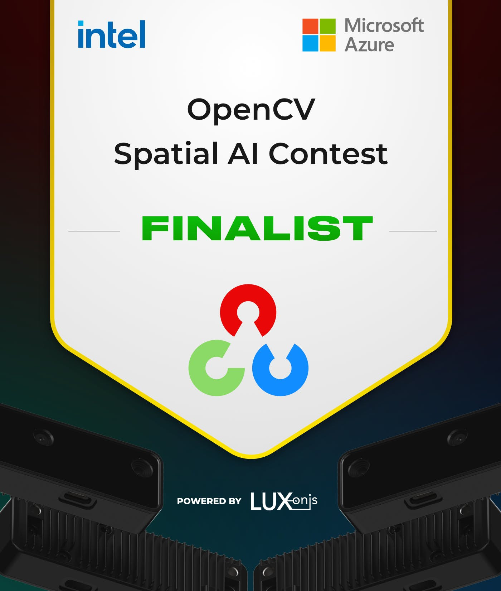

# ARNEIS

`A`utomated `R`ecognizer, `N`etwork-`E`nabled, `I`tems Sorter.

([Watch the video on YouTube](https://www.youtube.com/watch?v=7qxbT31U5dE))

## Project Documentation

The documentation of the ARNEIS project is published at <https://arneis.readthedocs.io/>.

The sources of the ARNEIS project documentation are stored inside the `/docs` subfolder of this repository. 
Whenever the `main` branch is updated, <https://arneis.readthedocs.io/> will be updated accordingly.

### Latest news

The ARNEIS project roadmap is [maintained on GitHub](https://github.com/B-AROL-O/ARNEIS/milestones?direction=asc&sort=due_date&state=open).

[Gianpaolo Macario](https://github.com/gmacario/) publishes regular updates of the ARNEIS project on [his personal blog](https://gmacario.github.io/posts).

You may also follow [twitter.com/baroloteam](https://twitter.com/baroloteam) to get notified about the progress of the project.

### How to get in touch

Please report bugs and feature requests on <https://github.com/B-AROL-O/ARNEIS/issues>, or DM [B-AROL-O Team on Twitter](https://twitter.com/baroloteam) about security issues or other non-public topics.

### ARNEIS is an OpenCV Spatial AI Contest Finalist

> Da: OpenCV Competition <competition@opencv.org> 
> Date: ven 17 dic 2021 alle ore 18:32 
> Subject: Your Team Is An OpenCV Spatial AI Contest Finalist! 
> To: Gianpaolo <gmacario@gmail.com>
>
> Hello Gianpaolo,
>
> Congratulations.
> Your team “B-AROL-O Bottling Systems” and project “ARNEIS: Automated Recognizer, Network-Enabled, Items Sorter” have been selected as one of just 50 teams to move on to Phase 2 of OpenCV Spatial AI Contest.
> Your team name and region are listed on the official webpage at <https://opencv.org/opencv-spatial-ai-contest/>

<!--  -->

## Copyright and license

Copyright (C) 2021-2022, [B-AROL-O Bottling Systems team](https://github.com/B-AROL-O), all rights reserved.

The code contained in this repository and the executable distributions are licensed under the terms of the MIT license as detailed in the [LICENSE](LICENSE) file.

<!-- EOF -->
