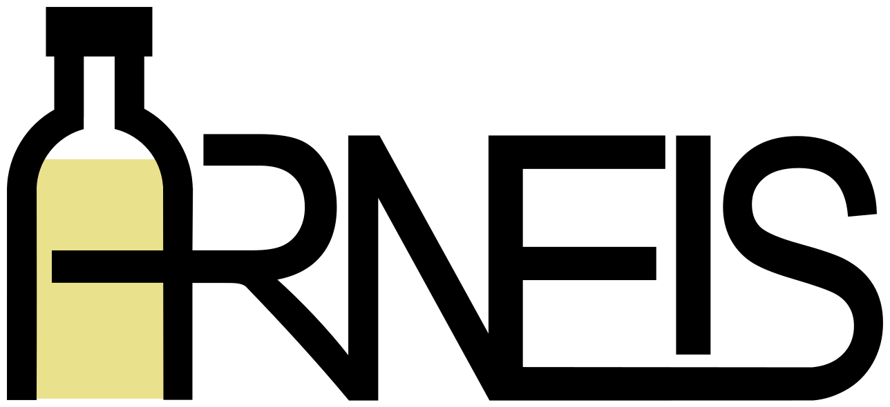

# ARNEIS

The **ARNEIS** (short for `A`utomated `R`ecognizer, `N`etwork-`E`nabled, `I`tems Sorter) project is one of the 50 selected finalists of the [OpenCV Spatial AI Contest](https://opencv.org/opencv-spatial-ai-contest/) sponsored by [Intel&reg;](https://www.intel.com/) and [Microsoft Azure](https://azure.microsoft.com/).

## Latest news

The ARNEIS project roadmap is [maintained on GitHub](https://github.com/B-AROL-O/ARNEIS/milestones?direction=asc&sort=due_date&state=open).

[Gianpaolo Macario](https://github.com/gmacario/) publishes regular updates of the ARNEIS project on [his personal blog](https://gmacario.github.io/posts).

You may also follow [twitter.com/baroloteam](https://twitter.com/baroloteam) to get notified about the progress of the project.

## Project Documentation

The documentation of the ARNEIS project is published at <https://arneis.readthedocs.io/>.

The sources of the ARNEIS project documentation are stored inside the [`/docs`](/docs) subfolder of this repository. 
Whenever the `main` branch is updated, <https://arneis.readthedocs.io/> will be updated accordingly.

## How to get in touch

Please report bugs and feature requests on <https://github.com/B-AROL-O/ARNEIS/issues>, or DM [B-AROL-O Team on Twitter](https://twitter.com/baroloteam) about security issues or other non-public topics.

## Copyright and license

Copyright (C) 2021-2022, [B-AROL-O Bottling Systems team](https://github.com/B-AROL-O), all rights reserved.

The code contained in this repository and the executable distributions are licensed under the terms of the MIT license as detailed in the [LICENSE](LICENSE) file.

<!-- EOF -->
