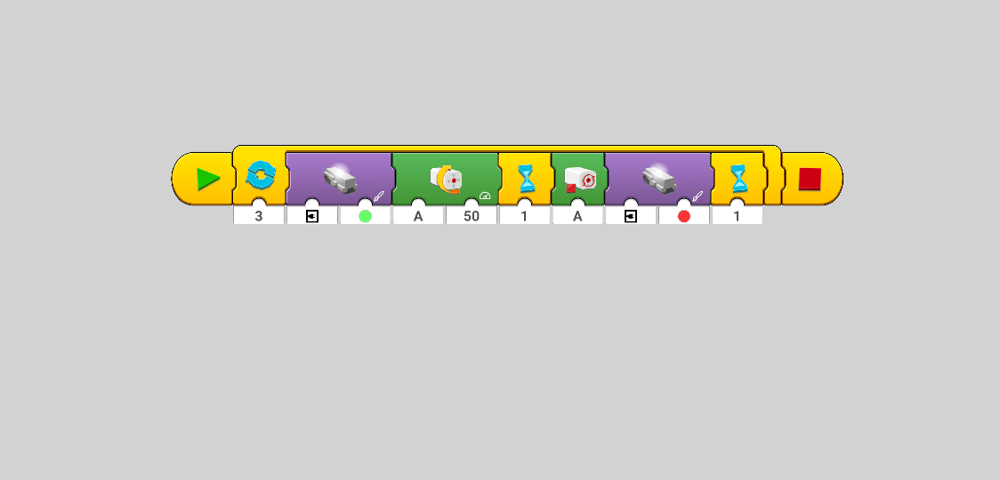

# poweredupapp-flash-move

This folder contains a simple project for the [LEGO&reg; Powered Up](https://play.google.com/store/apps/details?id=com.lego.common.poweredup) App.

## Prerequisites

* [ ] A mobile device (phone or tablet) running Android
* [ ] One LEGO&reg; Technic&reg; Bluetooth Hub (Item no. [bb0961c01](https://www.bricklink.com/v2/catalog/catalogitem.page?P=bb0961c01&idColor=86))
* [ ] One LEGO&reg; Powered Up L Motor (Item no. [bb0959c01](https://www.bricklink.com/v2/catalog/catalogitem.page?P=bb0959c01&idColor=85))
* [ ] 6x AA fully charged batteries

## Setup

* [ ] Install the [LEGO&reg; Powered Up](https://play.google.com/store/apps/details?id=com.lego.common.poweredup) app on your mobile device
* [ ] Insert the batteries on the Hub
* [ ] Connect the motor to port A of the Hub

## How to load the project on your mobile device

* [ ] Start the "LEGO&reg; Powered Up" app on your device
* [ ] Create a new blank project, then close the app
* [ ] Open the Android File Manager and navigate to the folder
  "Internal Storage/Android/data/com.lego.common.poweredup/files/Activities"
* [ ] Find the latest subfolder that belongs to your blank project.
  You should overwrite the `program.json` file there with the one present in this directory
* [ ] Launch the Powered Up app and open your latest project. The thumbnail will be still the previous one but once you open it you should see the code blocks transferred from the other device. If you exit the project once then the thumbnail will be updated properly, too.

Reference: [How to export/import a project in the Powered Up app on Android](https://racingbrick.com/2020/01/how-to-export-import-a-project-in-the-powered-up-app-on-android/)

<!-- EOF -->
