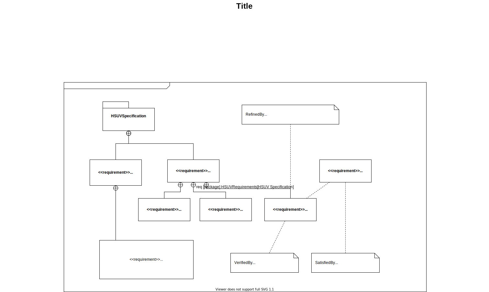

# ARNEIS - System Architecture

## Reference Documents

* [ARNEIS Project Proposal](https://github.com/B-AROL-O/) as submitted for the Phase 1 of the [OpenCV Spatial AI Contest](https://opencv.org/opencv-spatial-ai-contest/) - B-AROL-O Bottling Systems team, 2021-11-20 (PDF, 5 pages)
* [OMG Systems Modeling Language (OMG SysML™) Tutorial](https://www.omgsysml.org/INCOSE-OMGSysML-Tutorial-Final-090901.pdf) - September, 2009 (PDF, 132 pages)

<!--
## High-Level Architecture

-->

## Main mechatronic components

**NOTE**: In this list we deliberately omitted functions and services provided on the cloud, which are clearly available through the internet connection.

### Client devices and HMI

* **Client1**: Generic Android phone
  - Reference model: [Huwaei Mate 10 Pro](https://consumer.huawei.com/it/support/phones/mate10-pro/)
  - Connected to internet via Wi-Fi through AP1 (or mobile network)
  - Connected to RPI4 via Wi-Fi through AP1
* **Client2**: Generic Android tablet
  - Reference model: [Lenovo TB-X606F](https://www.amazon.it/Lenovo-TB-X606F-Processore-MediaTek-Espandibile/dp/B083QSRJ2F)
  - Connected to internet via Wi-Fi through AP1
  - Connected to RPI4 via Wi-Fi through AP1
* **Client3**: Generic iOS phone
  - Reference model: [iPhone SE](https://en.wikipedia.org/wiki/IPhone_SE_(1st_generation))
  - Connected to internet via Wi-Fi through AP1 (or mobile network)
  - Connected to RPI4 via Wi-Fi through AP1

### CPU and network devices

* **RPI4**: Raspberry Pi 4. Acting as main controller and gateway to cameras, sensors and actuators, as well as edge server to communicate with the services on the cloud
  - USB0: USB 3.0 Port #1. Connected to CAM1 via USB-A to USB-C cable
  - USB1: USB 3.0 Port #2. TODO
  - USB2: USB 2.0 Port #1. Connect to a USB keyboard (for debug purposes)
  - USB3: USB 2.0 Port #2. Connect to a USB mouse (for debug purposes)
  - MicroHDMI0: Connect to a HDMI display using a MicroHDMI-to-HDMI cable (for debug purposes)
  - Acting as BLE central
  - Connected to AP1 using wired Ethernet through a RJ-45 cable. In case wired Ethernet is not available, connect to AP1 through Wi-Fi
  - Services: SSH, http, others?
* **AP1**: Access Point and internet router
  - Reference model: [Linksys WRT54GL](https://downloads.linksys.com/downloads/userguide/WRT54GL_V11_UG_C-Web.pdf)
* **HUB1**: [Electric Battery Box Powered Up Bluetooth Hub with Dark Bluish Gray Bottom](https://www.bricklink.com/v2/catalog/catalogitem.page?P=bb0961c01#T=C)
  - Connected to RPI4 via Bluetooth (acting as BLE peripheral)
* **HUB2**: [Electric Battery Box Powered Up Bluetooth Hub with Dark Bluish Gray Bottom](https://www.bricklink.com/v2/catalog/catalogitem.page?P=bb0961c01#T=C)
  - Connected to RPI4 via Bluetooth (acting as BLE peripheral)
* (TBV) **HUB3**: Mindstorms NXT Control Hub
  - Connected to RPI4 using a USB-B to USB-A cable
* (TBV) **SBRICK1**: Sbrick Plus
  - Connected to RPI4 via Bluetooth (acting as BLE peripheral)
* (TBV) **SBRICK2**: Sbrick Plus
  - Connected to RPI4 via Bluetooth (acting as BLE peripheral)
* (TBV) **PMC1**: [Arduino Portenta Machine Control](https://www.arduino.cc/pro/hardware/product/portenta-machine-control)
  - Connected to RPI4 via USB (or BLE? Or Ethernet?)
* (TBV) **NICLA1**: [Arduino Nicla Sense ME](https://docs.arduino.cc/hardware/nicla-sense-me)
  - Connected to RPI4 via Bluetooth (acting as BLE peripheral)

### Computer Vision devices

* **CAM1**: [OAK-D-Lite](https://docs.luxonis.com/projects/hardware/en/latest/pages/DM9095.html) (Auto Focus)
  - Connected via a USB-A to USB-C cable (USB 3.0 or later) to RPI4
* (TBV) **CAM2**: [OAK-D-Lite](https://docs.luxonis.com/projects/hardware/en/latest/pages/DM9095.html) (Auto Focus)
* (TBV) **CAM3**: [OAK-D-Lite](https://docs.luxonis.com/projects/hardware/en/latest/pages/DM9095.html) (Auto Focus)
* (TBV) **CAM4**: [OAK-D-Lite](https://docs.luxonis.com/projects/hardware/en/latest/pages/DM9095.html) (Auto Focus)

### Actuators

* **M1**: [Electric, Motor Powered Up, XL](https://www.bricklink.com/pages/clone/catalogitem.page?P=bb0960c01&C=85)
  - Purpose: TODO
  - Connected to HUB1 through its Power Up cable
* **M2**: [Electric, Motor Powered Up, XL](https://www.bricklink.com/pages/clone/catalogitem.page?P=bb0960c01&C=85)
  - Purpose: TODO
  - Connected to HUB1 through its Power Up cable
* **M3**: [Electric, Motor Powered Up, XL](https://www.bricklink.com/pages/clone/catalogitem.page?P=bb0960c01&C=85)
  - Purpose: TODO
  - Connected to HUB1 through its Power Up cable
* **M4**: [Electric, Motor Powered Up, L](https://www.bricklink.com/pages/clone/catalogitem.page?P=bb0959c01&C=85)
  - Purpose: TODO
  - Connected to HUB1 through its Power Up cable
* **M5**: [Electric, Motor Powered Up, L](https://www.bricklink.com/pages/clone/catalogitem.page?P=bb0959c01&C=85)
  - Purpose: TODO
  - Connected to HUB2 through its Power Up cable
* **M6**: [Electric, Motor Powered Up, L](https://www.bricklink.com/pages/clone/catalogitem.page?P=bb0959c01&C=85)
  - Purpose: TODO
  - Connected to HUB2 through its Power Up cable
* **M7**: [Electric, Motor Powered Up, L](https://www.bricklink.com/pages/clone/catalogitem.page?P=bb0959c01&C=85)
  - Purpose: TODO
  - Connected to HUB2 through its Power Up cable
* (TBV) **EJCT1**: Ejector TODO
  - Purpose: TODO
  - Mechanically connected to (TBV) Mx
* (TBV) **EJCT2**: Ejector TODO
  - Purpose: TODO
  - Mechanically connected to (TBV) Mx
* (TBV) **EJCT3**: Ejector TODO
  - Purpose: TODO
  - Mechanically connected to (TBV) Mx
* TODO: LEGO Power Functions motor/switches/lights controlled via SBrick?
* TODO: LEGO Mindstorms NXT motors/switches/lights controlled via Mindstorms CPU?

### Misc

* TODO: Lights?
* TODO: Physical push buttons/encoders/etc?

<!-- EOF -->
