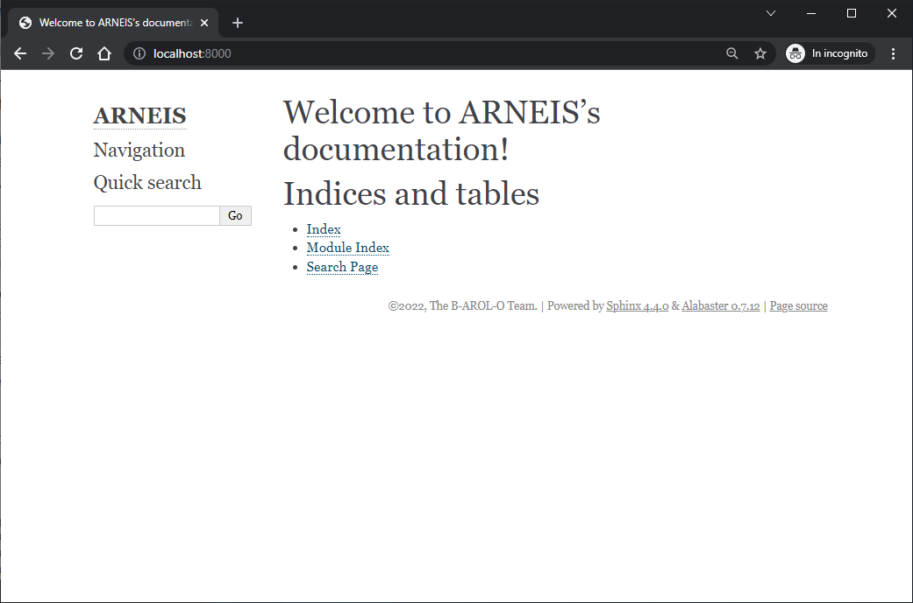
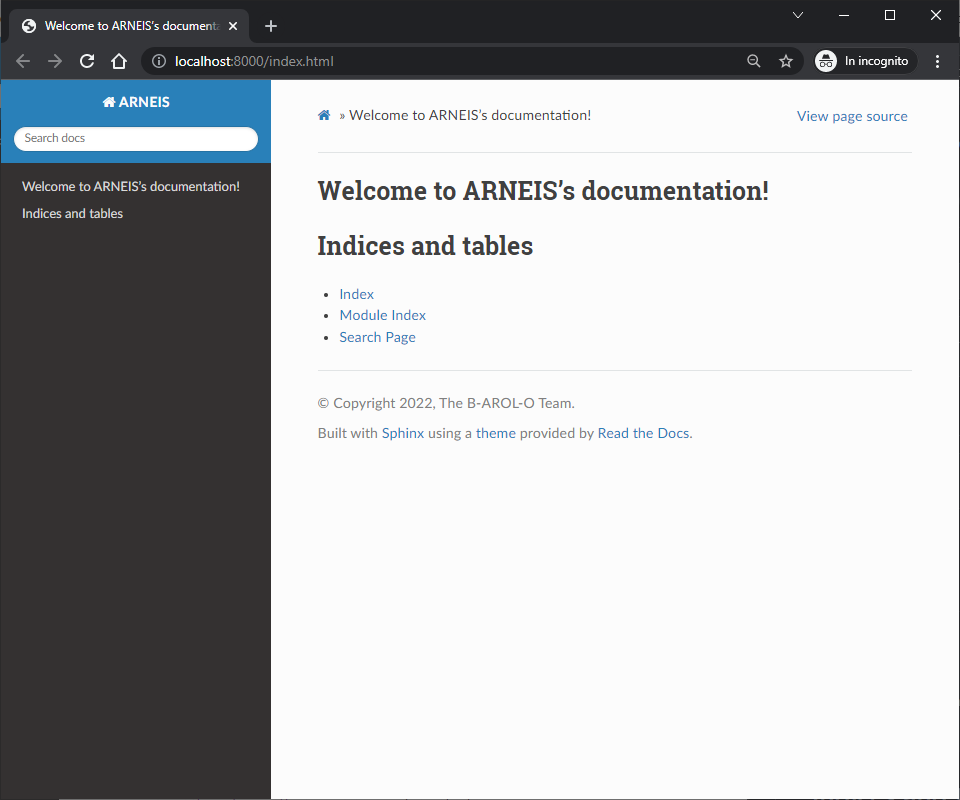
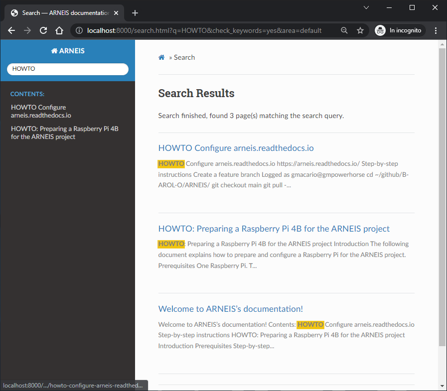

# HOWTO Configure arneis.readthedocs.io

## Introduction

This document explains the steps performed for preparing the automated deployment
of site <https://arneis.readthedocs.io/> based on the contents of GitHub repository
<https://github.com/B-AROL-O/ARNEIS>.

## References

* <https://readthedocs.org/>
* <https://docs.readthedocs.io/>
* <https://www.sphinx-doc.org/>

## Step-by-step instructions

### Create a feature branch

Logged as gmacario@gmpowerhorse

```bash
cd ~/github/B-AROL-O/ARNEIS/
git checkout main
git pull --all --prune
```

Create a feature branch

```bash
git checkout -b feat/issue-29-readthedocs
```

### Create initial Sphinx configuration

Follow instructions at <https://docs.readthedocs.io/en/stable/intro/getting-started-with-sphinx.html>

Create initial Sphinx configuration

```bash
cd docs
python3 -m venv .venv
source .venv/bin/activate
pip3 install sphinx
sphinx-quickstart
```

Fill in the required information:

```text
(.venv) gmacario@gmpowerhorse:~/github/B-AROL-O/ARNEIS/docs (feat/issue-29-readthedocs)$ sphinx-quickstart 
Welcome to the Sphinx 4.4.0 quickstart utility.

Please enter values for the following settings (just press Enter to
accept a default value, if one is given in brackets).

Selected root path: .

You have two options for placing the build directory for Sphinx output.
Either, you use a directory "_build" within the root path, or you separate
"source" and "build" directories within the root path.
> Separate source and build directories (y/n) [n]: 

The project name will occur in several places in the built documentation.
> Project name: ARNEIS
> Author name(s): The B-AROL-O Team
> Project release []: 

If the documents are to be written in a language other than English,
you can select a language here by its language code. Sphinx will then
translate text that it generates into that language.

For a list of supported codes, see
https://www.sphinx-doc.org/en/master/usage/configuration.html#confval-language.
> Project language [en]:  

Creating file /home/gmacario/github/B-AROL-O/ARNEIS/docs/conf.py.
Creating file /home/gmacario/github/B-AROL-O/ARNEIS/docs/index.rst.
Creating file /home/gmacario/github/B-AROL-O/ARNEIS/docs/Makefile.
Creating file /home/gmacario/github/B-AROL-O/ARNEIS/docs/make.bat.

Finished: An initial directory structure has been created.

You should now populate your master file /home/gmacario/github/B-AROL-O/ARNEIS/docs/index.rst and create other documentation
source files. Use the Makefile to build the docs, like so:
   make builder
where "builder" is one of the supported builders, e.g. html, latex or linkcheck.

(.venv) gmacario@gmpowerhorse:~/github/B-AROL-O/ARNEIS/docs (feat/issue-29-readthedocs)*$
```

### Locally build the static HTML site

Run the following command:

```bash
make html
```

Result:

```text
(.venv) gmacario@gmpowerhorse:~/github/B-AROL-O/ARNEIS/docs (feat/issue-29-readthedocs)*$ make html
Running Sphinx v4.4.0
making output directory... done
building [mo]: targets for 0 po files that are out of date
building [html]: targets for 1 source files that are out of date
updating environment: [new config] 1 added, 0 changed, 0 removed
reading sources... [100%] index                  
looking for now-outdated files... none found
pickling environment... done
checking consistency... done
preparing documents... done
writing output... [100%] index                   
generating indices... genindex done
writing additional pages... search done
copying static files... done
copying extra files... done
dumping search index in English (code: en)... done
dumping object inventory... done
build succeeded.

The HTML pages are in _build/html.
(.venv) gmacario@gmpowerhorse:~/github/B-AROL-O/ARNEIS/docs (feat/issue-29-readthedocs)*$
```

#### Test the generated website

Run a simple http server to make the generated pages available on the network:

```bash
cd ~/github/B-AROL-O/ARNEIS/docs/
python3 -m http.server --directory _build/html/
```

then if you open `http://localhost:8000/` from your browser, the home page of the generated website should be displayed.



All the http requests will also be logged on the terminal where you launched the http server:

```text
(.venv) gmacario@gmpowerhorse:~/github/B-AROL-O/ARNEIS/docs (feat/docsite-add-links)*$ python3 -m http.server --directory _build/html/
Serving HTTP on 0.0.0.0 port 8000 (http://0.0.0.0:8000/) ...
127.0.0.1 - - [22/Jan/2022 07:48:24] "GET / HTTP/1.1" 304 -
127.0.0.1 - - [22/Jan/2022 07:48:24] "GET /_static/pygments.css HTTP/1.1" 304 -
127.0.0.1 - - [22/Jan/2022 07:48:24] "GET /_static/css/theme.css HTTP/1.1" 304 -
127.0.0.1 - - [22/Jan/2022 07:48:24] "GET /_static/documentation_options.js HTTP/1.1" 304 -
127.0.0.1 - - [22/Jan/2022 07:48:24] "GET /_static/js/theme.js HTTP/1.1" 304 -
127.0.0.1 - - [22/Jan/2022 07:48:25] "GET /_static/css/fonts/lato-normal.woff2?bd03a2cc277bbbc338d464e679fe9942 HTTP/1.1" 304 -
127.0.0.1 - - [22/Jan/2022 07:48:25] "GET /_static/css/fonts/fontawesome-webfont.woff2?af7ae505a9eed503f8b8e6982036873e HTTP/1.1" 304 -
127.0.0.1 - - [22/Jan/2022 07:48:25] "GET /_static/css/fonts/lato-bold.woff2?cccb897485813c7c256901dbca54ecf2 HTTP/1.1" 304 -
127.0.0.1 - - [22/Jan/2022 07:48:25] "GET /_static/css/fonts/Roboto-Slab-Bold.woff2?9984f4a9bda09be08e83f2506954adbe HTTP/1.1" 304 -
127.0.0.1 - - [22/Jan/2022 07:48:32] "GET /genindex.html HTTP/1.1" 200 -
127.0.0.1 - - [22/Jan/2022 07:48:36] "GET /index.html HTTP/1.1" 200 -
```

### Add the Read the Docs Sphinx Theme

Reference: <https://sphinx-rtd-theme.readthedocs.io/>

Make sure the following package is included in `docs/requirements.txt`

```text
sphinx_rtd_theme==1.0.0
```

Add the following configuration to `docs/conf.py`

```python
extensions = ['sphinx_rtd_theme']

html_theme = 'sphinx_rtd_theme'
```

Test as usual with the following commands

```bash
cd ~/github/B-AROL-O/ARNEIS/docs/
python3 -m http.server --directory _build/html/
```

then open <http://localhost:8000/> from your browser.
Verify that the Read the Docs Sphinx Theme has been applied to the website:



### Adding support for Markdown

Reference: <https://www.sphinx-doc.org/en/master/usage/markdown.html>

```bash
cd ~/github/B-AROL-O/ARNEIS/docs
pip3 install --upgrade myst-parser
```

Add _myst_parser_ to the [list of configured extensions](https://www.sphinx-doc.org/en/master/usage/configuration.html#confval-extensions)

```python
extensions = [
    'myst_parser'
]
```

Test as usual with the following commands

```bash
cd ~/github/B-AROL-O/ARNEIS/docs/
python3 -m http.server --directory _build/html/
```

then open <http://localhost:8000/> from your browser.

Type "HOWTO" into the "Search docs" input field and verify that the Markdown pages have been included as well



### Implement preview for Pull Requests

<!-- (2022-01-25 05:35 CET) -->

References:
* <https://github.com/B-AROL-O/ARNEIS/issues/85>
* [Preview Documentation from Pull Requests](https://docs.readthedocs.io/page/guides/autobuild-docs-for-pull-requests.html)

In order to enable the Pull Request preview feature you should execute the following steps:

1. In your _Read the Docs_ project page select the `Admin` menu

   

1. In `Advanced Settings` select **Build pull requests for this project**

   

3. That's all. For each pull request an automatic check which builds the document on _Read The Docs_ is added. You can check the result of this compilation in the `Detail` information for this check.

   

### Removing the Ads

<!-- (2022-01-27 07:35 CET) -->

References:

* <https://docs.readthedocs.io/en/stable/advertising/ethical-advertising.html>

There are multiple ways to opt out of the advertising on Read the Docs.

1. You can go completely ad-free by becoming a [Gold member](https://readthedocs.org/accounts/gold/) or a [Supporter](https://readthedocs.org/sustainability/#donations).
   Additionally, Gold members may remove advertising from their projects for all visitors.

2. You can opt out of seeing paid advertisements on documentation pages:
   * Go to the drop down user menu in the top right of the Read the Docs dashboard and clicking **Settings** (<https://readthedocs.org/accounts/edit/>).
   * On the **Advertising** tab, you can deselect **See paid advertising**.
  
   You will still see [community ads](https://docs.readthedocs.io/en/stable/advertising/ethical-advertising.html#community-ads) for open source projects and conferences.

3. Project owners can also opt out of paid advertisements for their projects.
   You can change these options:
   * Go to your **project** page (`/projects/<slug>/`)
   * Go to **Admin** > **Advertising**
   * Change your advertising settings

4. If you are part of a company that uses Read the Docs to host documentation for a commercial product, [Read the Docs for Business](https://docs.readthedocs.io/en/stable/commercial/index.html) offers a completely ad-free experience, additional build resources, and other great features like CDN support and private documentation.

5. If you would like to completely remove advertising from your open source project, but our commercial plans don’t seem like the right fit, you may [get in touc with ReadTheDocs.org](mailto:ads@readthedocs.org) to discuss alternatives to advertising.

<!-- EOF -->
