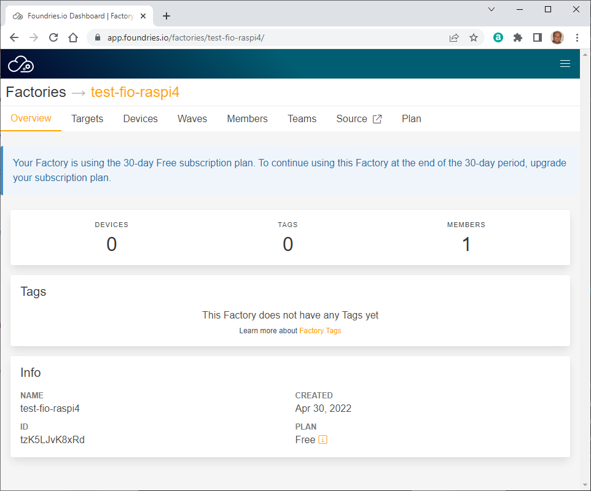
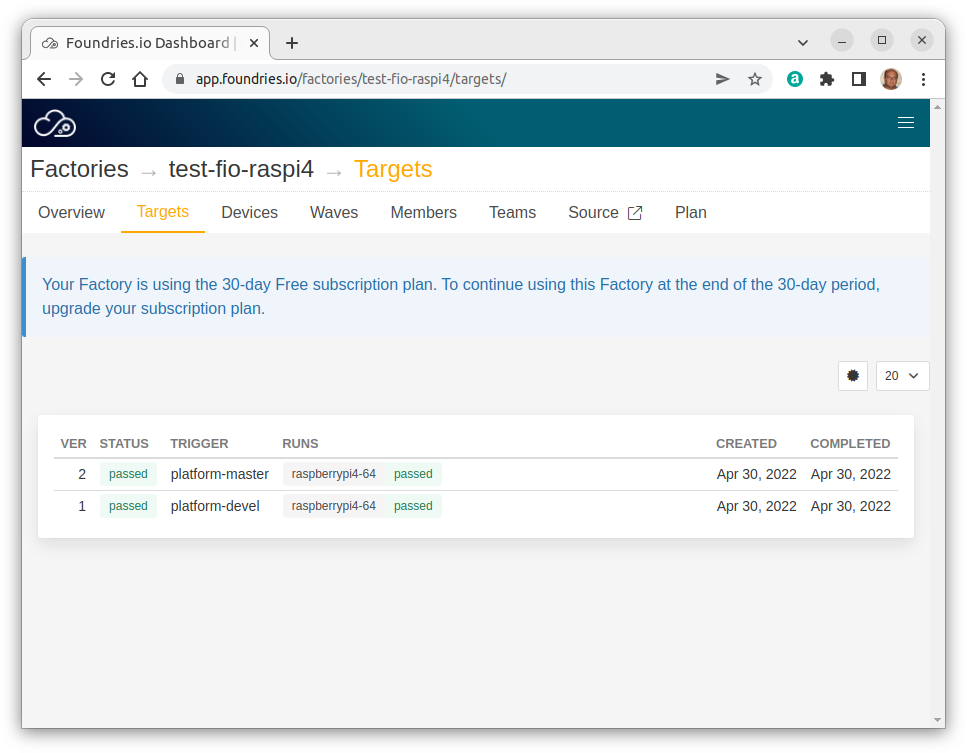
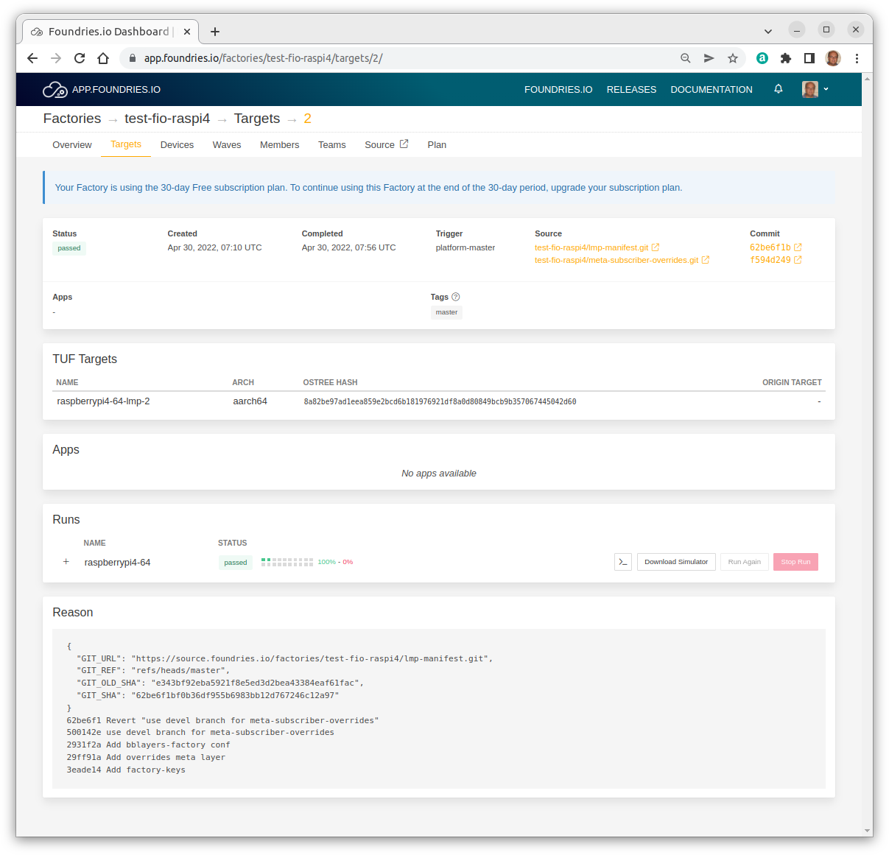
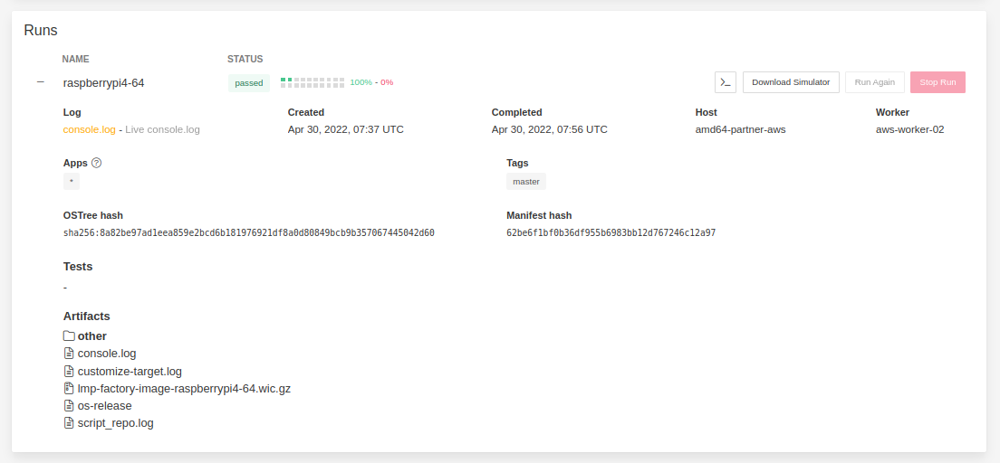
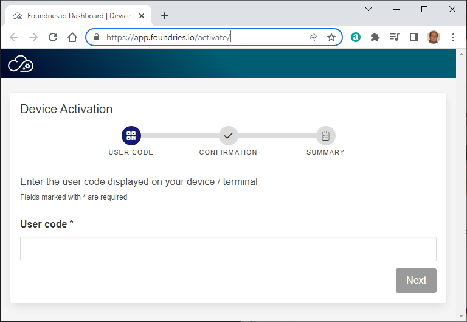
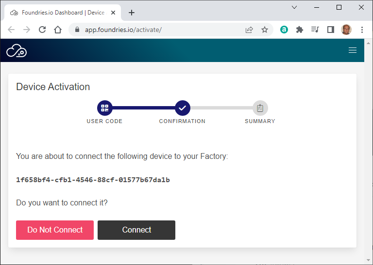
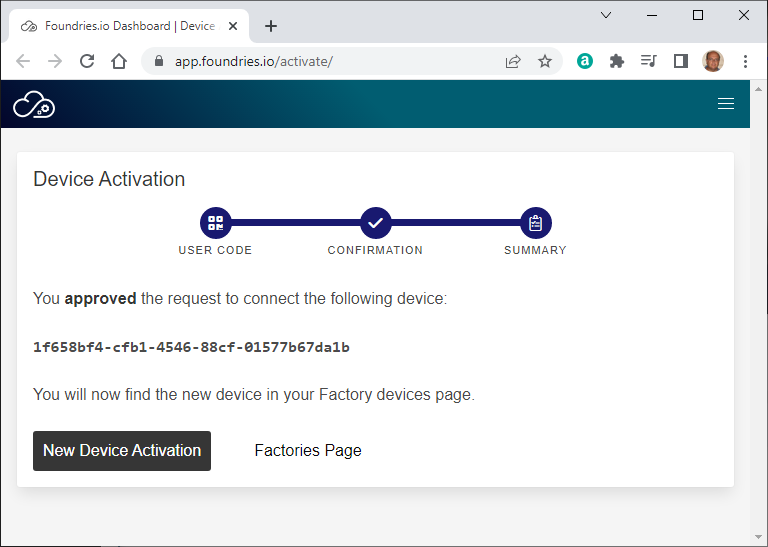
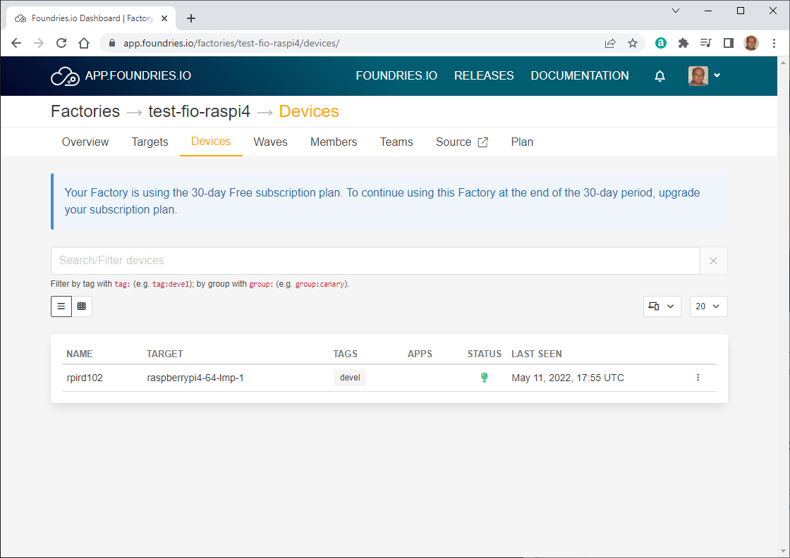
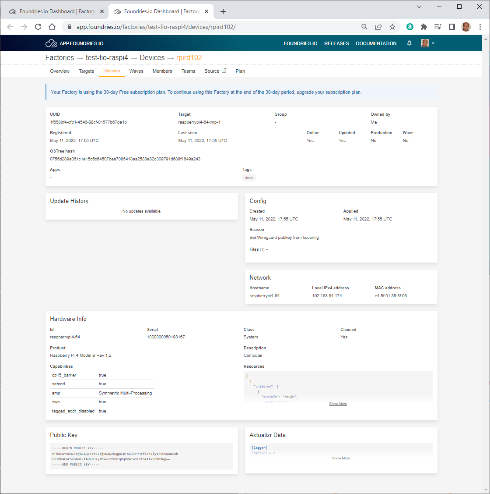
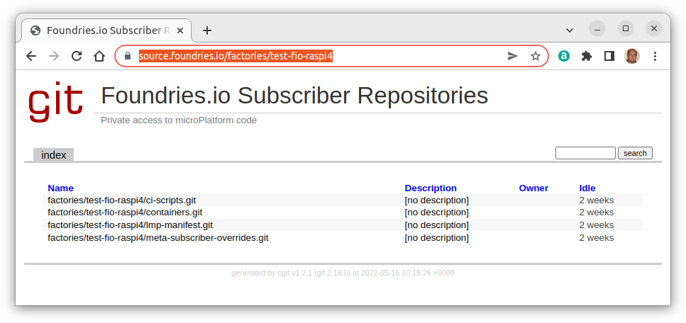

# HOWTO Getting started with Foundries.io

## Introduction

This document explains how to use Foundries.io [FoundriesFactory](https://foundries.io/) cloud service.

FoundriesFactory is a cloud service to build, test, deploy, and maintain secure, updatable IoT and Edge products. It is used to customize open source software projects including u-Boot, OP-TEE, OE/Yocto Project, the Linux microPlatform™ and Docker®.

## Reference documents

* <https://foundries.io/>
* <https://docs.foundries.io/>
* <https://foundries.io/insights/news/foundriesio-arduino-secure-embedded-solution/>


## Preparation

Login to <https://app.foundries.io/>, or first create an account if you have not one.

### Create a Factory

Browse <https://app.foundries.io/factories>

> **No Factories**
>
> Create your first Factory, and start your next product.
>
> [New Factory...](https://app.foundries.io/factories) | [Learn more](https://docs.foundries.io/latest/getting-started/signup/index.html#create-a-factory)

Click on "New Factory..."

> **Create Factory**
>
> **Choose a name for your factory**
>
> Fields marked with \* are required
>
> * **Platform** \*: Default (RaspberryPi 64-bit)
>
> * **Factory name** \*: (empty)
>   - 2 to 26 lowercase alphanumeric characters, must start with an alphanumeric character, can contain also - and _
>
> Cancel | Prev | Next

Fill in the required information

* Platform: `Default (RaspberryPi 4 64-bit)`
* Factory name: `test-fio-raspi4`

then click "Next".

> **Select a subscription plan for your factory**
>
> Pay Monthly | Pay Yearly
>
> **Free / $0 / 30-day trial**
> - No credit card required
> - For personal use
> - 3 builds a day
> - 10 managed devices
> - community support
>
> **Commercial / $5,000 / product / month**
> - For commercial use
> - Unlimited builds
> - Unlimited managed devices
> - Priority support
>
> Prices do not include taxes: we might have to collect taxes based on your billing country.
>
> Cancel | Prev | Next

Select "Free", then click "Next"

<!-- (2022-04-30 09:04 CEST) -->

<!-- markdown-link-check-disable -->
> **Almost there, review & create your factory**
>
> Fields marked with \* are required
>
> * Factory name: test-fio-raspi4
> * Factory platform: Default (RaspberryPi 4 64-bit)
> * Selected plan: Free Factory
> * Plan fee: $ 0
> * Taxes: $ 0
> * Total before taxes: $ 0
> * Total due on **Apr 30, 2022**: $ 0
>
> * [ ] I agree to the [FoundriesFactory Subscription](https://foundries.io/terms/) terms \*
>
> Cancel | Prev | Create Factory
<!-- markdown-link-check-enable -->

Review the displayed information, check "I agree", then click "Create Factory".



### Inspect the built system images

If you click on tab "Targets" you will find the list of completed builds:



As an example, click on version "2" to display the details of this specific target build:



If you expand the "Runs" panel you have access to the build artifacts:



Click on a specific artifact to display its contents.

### Install the `fioctl` tool

Install the `fioctl` tool following the instructions at <https://docs.foundries.io/latest/getting-started/install-fioctl/index.html> - for instance, on Linux

```bash
export FIOCTL_VERSION=v0.25
sudo curl -o /usr/local/bin/fioctl -LO https://github.com/foundriesio/fioctl/releases/download/$FIOCTL_VERSION/fioctl-linux-amd64
sudo chmod +x /usr/local/bin/fioctl
```

Verify the correct installation of `fioctl`

```text
gmacario@hw2228:~ $ fioctl
Manage Foundries Factories

Usage:
  fioctl [command]

Available Commands:
  completion       Generate completion script
  config           Manage configuration common to all devices in a factory
  configure-docker Configure a hub.foundries.io Docker credential helper
  devices          Manage devices registered to a factory
  event-queues     Manage event queues configured for a Factory
  help             Help about any command
  keys             Manage keys in use by your factory fleet
  login            Access Foundries.io services with your client credentials
  logout           Remove Foundries.io client credentials from system
  secrets          Manage secret crendentials configured in a factory
  status           Get dashboard view of a factory and its devices
  targets          Manage factory's TUF targets
  teams            List teams belonging to a FoundriesFactory
  users            List users with access to a FoundriesFactory
  version          Show version information of this tool.
  waves            Manage factory's waves

Flags:
  -c, --config string   config file (default is $HOME/.config/fioctl.yaml)
  -h, --help            help for fioctl
  -v, --verbose         Print verbose logging

Use "fioctl [command] --help" for more information about a command.
gmacario@hw2228:~ $
```


## Deploy your first device using FoundriesFactory

Follow the instructions at <https://docs.foundries.io/latest/getting-started/flash-device/index.html>

In our example we will be creating a bootable microSD Card for the Raspberry Pi 4.

### Download LmP system image

Login to <https://app.foundries.io/>, then select a Factory which you have access to - in our example, `test-fio-raspi4`.

(Optional) Take note of the Source URLs and their related Commits - in our example:

| Source | Commit |
|--------|--------|
| [test-fio-raspi4/lmp-manifest.git](https://source.foundries.io/factories/test-fio-raspi4/lmp-manifest.git) | [500142e1](https://source.foundries.io/factories/test-fio-raspi4/lmp-manifest.git/commit/?id=500142e17aa6480eb4428c1ca9b7466ed45f7396)
| [test-fio-raspi4/meta-subscriber-overrides.git](https://source.foundries.io/factories/test-fio-raspi4/meta-subscriber-overrides.git) | [f594d249](https://source.foundries.io/factories/test-fio-raspi4/meta-subscriber-overrides.git/commit/?id=f594d249aabada5535a95606127651f79f0be85b) |


Navigate to the "Targets" section of your Factory, then click the latest Target with the `platform-devel` Trigger. Expand the run in the "Runs" section with corresponds with the name of the board, then click "Download Simulator" (TBV).

In our example, this operation will download file `lmp-factory-image-raspberrypi4-64.wic.gz` (218 MB).

### Flash LmP system image

Write the image to a blank microSD Card using a tool such as [balenaEtcher](https://www.balena.io/etcher/).

### Boot device and connect to the network

1. Connect an Ethernet cable to the board
2. Insert the microSD into the Raspberry Pi and
3. Power up the board

You board will connect to the network via Ethernet and will be ready to connect within a minute or two of booting.

```text
Linux-microPlatform 3.4.3-1-86-4-g500142e raspberrypi4-64 tty1

raspberrypi4-64 login:
```

Default username/password: `fio`/`fio`

Verify assigned IP address

```text
fio@raspberrypi4-64:~$ ip addr
1: lo: <LOOPBACK,UP,LOWER_UP> mtu 65536 qdisc noqueue state UNKNOWN group default qlen 1000
    link/loopback 00:00:00:00:00:00 brd 00:00:00:00:00:00
    inet 127.0.0.1/8 scope host lo
       valid_lft forever preferred_lft forever
    inet6 ::1/128 scope host
       valid_lft forever preferred_lft forever
2: eth0: <BROADCAST,MULTICAST,UP,LOWER_UP> mtu 1500 qdisc mq state UP group default qlen 1000
    link/ether e4:5f:01:35:8f:96 brd ff:ff:ff:ff:ff:ff
    inet 192.168.64.174/24 brd 192.168.64.255 scope global dynamic noprefixroute eth0
       valid_lft 43123sec preferred_lft 43123sec
    inet6 fdaf:ad6a:c9df::17a/128 scope global noprefixroute
       valid_lft forever preferred_lft forever
    inet6 fdaf:ad6a:c9df:0:d17:705f:18ab:1617/64 scope global noprefixroute
       valid_lft forever preferred_lft forever
    inet6 fe80::eab4:9416:5a41:8b86/64 scope link noprefixroute
       valid_lft forever preferred_lft forever
3: sit0@NONE: <NOARP> mtu 1480 qdisc noop state DOWN group default qlen 1000
    link/sit 0.0.0.0 brd 0.0.0.0
4: wlan0: <NO-CARRIER,BROADCAST,MULTICAST,UP> mtu 1500 qdisc fq_codel state DOWN group default qlen 1000
    link/ether ce:fd:ee:3d:6e:47 brd ff:ff:ff:ff:ff:ff permaddr dc:a6:32:4e:db:b2
5: docker0: <NO-CARRIER,BROADCAST,MULTICAST,UP> mtu 1500 qdisc noqueue state DOWN group default
    link/ether 02:42:4f:27:c0:b7 brd ff:ff:ff:ff:ff:ff
    inet 172.17.0.1/16 brd 172.17.255.255 scope global docker0
       valid_lft forever preferred_lft forever
fio@raspberrypi4-64:~$
```

### Register your device

Reference: <https://docs.foundries.io/latest/getting-started/register-device/index.html>

From a console on the device run this command to register the device to your factory:

```bash
sudo lmp-device-register -n <device-name>
```

Example:

```text
fio@raspberrypi4-64:~$ sudo lmp-device-register -n rpird102
Password:
Token is not specified, getting an oauth token from Foundries' auth endpoint...

----------------------------------------------------------------------------
Visit the link below in your browser to authorize this new device. This link
will expire in 15 minutes.
  Device Name: 1f658bf4-cfb1-4546-88cf-01577b67da1b
  User code: yDeY-Aevh
  Browser URL: https://app.foundries.io/activate/

Waiting for authorization /
```

From your browser visit the displayed URL <https://app.foundries.io/activate/>:



Type the specified User code, then click "Next":



Verify the displayed UUID, then click "Connect" if OK.



Some more messages will be displayed on the console:

```text
fio@raspberrypi4-64:~$ sudo lmp-device-register -n rpird102
Password:
Token is not specified, getting an oauth token from Foundries' auth endpoint...

----------------------------------------------------------------------------
Visit the link below in your browser to authorize this new device. This link
will expire in 15 minutes.
  Device Name: 1f658bf4-cfb1-4546-88cf-01577b67da1b
  User code: yDeY-Aevh
  Browser URL: https://app.foundries.io/activate/

Registering device, rpird102, to factory test-fio-raspi4.
Device UUID: 1f658bf4-cfb1-4546-88cf-01577b67da1b
Device is now registered.
Starting aktualizr-lite daemon
fio@raspberrypi4-64:~$
```

Verify on the "Devices" tab of the Factories page that the new device is now in the list of registered devices:



Click on the device to get more details:



NOTE: This device was registered on Gianpaolo RPi4, TBV whether the image will also work on the actual `rpird102`.

## Clone the factory Source Repositories

### Create a Source Code Access Token

Login to <https://app.foundries.io/> then click "Settings" > "Api Tokens" > "New Token"

> **Generate API Token**
>
> 1. INFO

Fill in the required information:

* Description: `git gmacario@hw2288`
* Expiration date: 2022-06-30

then click "Next".

> **Generate API Token**
>
> 2. SCOPES

Fill in the required information:

* Scopes: Use for source code access (`source:create`, `source:read-update`)
* Factory: `test-fio-raspi4`

then click "Generate".

> **Generate API Token**
>
> Your new API token has been created.
> Make sure you save the token value as you won't be able to access it again.

You may use the generated API token to authenticate and access private git source repositories, as shown in the next subsection.

### Browse the factory Source Repositories from the web interface

Logged in to <https://app.foundries.io> rowse the Foundries.io Subscriber Repositories. In our example

<https://source.foundries.io/factories/test-fio-raspi4>



### Configure Git

```bash
git config --global credential.helper store

mkdir -p ~/source.foundries.io/factories/<factory>
cd ~/source.foundries.io/factories/<factory>
```

### Clone the Container Source Repository

Clone the `containers.git` repository:

```bash
git clone -b devel https://source.foundries.io/factories/<factory>/containers.git
```

In our example

```text
gmacario@hw2228:~ $ git clone -b devel https://source.foundries.io/factories/test-fio-raspi4/containers.git
Cloning into 'containers'...
Username for 'https://source.foundries.io': gmacario@gmail.com
Password for 'https://gmacario@gmail.com@source.foundries.io': 
remote: Enumerating objects: 8, done.
remote: Counting objects: 100% (8/8), done.
remote: Compressing objects: 100% (8/8), done.
remote: Total 8 (delta 0), reused 0 (delta 0)
Unpacking objects: 100% (8/8), 1.21 KiB | 620.00 KiB/s, done.
gmacario@hw2228:~ $ 
```

Note: When requested by git, provide your Foundries.io as username (in our example, `gmacario@ŋmail.com`), then provide the generated API Token as password.

Using a similar command you may also clone the other source repositories of the factory:

```bash
git clone https://source.foundries.io/factories/<factory>/ci-scripts.git

git clone https://source.foundries.io/factories/<factory>/lmp-manifest.git

git clone https://source.foundries.io/factories/<factory>/meta-subscriber-overrides.git
```

## Deploy your first Application

Reference: <https://docs.foundries.io/latest/tutorials/deploying-first-app/deploying-first-app.html>

### Configure your device

To improve your experience during this tutorial, you will configure both `aktualizr-lite` and `fioconfig` to check every minute.

```bash
sudo mkdir -p /etc/sota/conf.d/
sudo bash -c 'printf "[uptane]\npolling_sec = 60" > /etc/sota/conf.d/z-01-polling.toml'

sudo bash -c 'printf "DAEMON_INTERVAL=60" > /etc/default/fioconfig'

sudo systemctl restart aktualizr-lite
sudo systemctl restart fioconfig
```

To watch the `aktualizr-lite` logs and see the updates, leave a device terminal running the command:

```bash
sudo journalctl --follow --unit aktualizr-lite
```

### Make changes to the `devel` branch of `containers.git`

TODO

### Debugging your device

Logged in on the development host, check the list of subscribed devices

```bash
fioctl login
fioctl devices list
```

Result:

```text
gmacario@hw2228:~ $ fioctl devices list
NAME      TARGET                 STATUS  APPS  UP-TO-DATE  IS-PROD
----      ------                 ------  ----  ----------  -------
rpird102  raspberrypi4-64-lmp-1  OK            true        false
gmacario@hw2228:~ $
```

Read information about device `rpird102`

```text
gmacario@hw2228:~ $ fioctl device show rpird102
UUID:		1f658bf4-cfb1-4546-88cf-01577b67da1b
Owner:		625ff36d02d292c0e482ecbf
Factory:	test-fio-raspi4
Production:	false
Up to date:	true
Target:		raspberrypi4-64-lmp-1 / sha256(0755d289a061c1e15c6c64507bee7085418aa2588e82c309791d688f1649a243)
Ostree Hash:	0755d289a061c1e15c6c64507bee7085418aa2588e82c309791d688f1649a243
Created:	2022-05-11T17:55:47+00:00
Last Seen:	2022-05-16T09:41:00+00:00
Tag:		devel
Network Info:
	Hostname:	raspberrypi4-64
	IP:		192.168.69.128
	MAC:		e4:5f:01:35:8f:96
Hardware Info: (hidden, use --hwinfo)
Aktualizr config: (hidden, use --aktoml)
Active Config:
	Created At:    2022-05-11T17:55:48+00:00
	Applied At:    2022-05-11T17:55:48+00:00
	Change Reason: Set Wireguard pubkey from fioconfig
	Files:
		wireguard-client
		 | enabled=0
		 | 
		 | pubkey=Po/bjvs8w8bGgBLdPsh1owUO9r18rfLf/a+981Hjp2g=

-----BEGIN PUBLIC KEY-----
MFkwEwYHKoZIzj0CAQYIKoZIzj0DAQcDQgAEp+s6JZYPHzfTZnJlys7HHVNANCob
US1BbACwCSvoBWE/fAHE0UKyIMYwu2ZnHzqOqPVA1wo1nlb41fxPcMD9Ng==
-----END PUBLIC KEY-----
gmacario@hw2228:~ $
```

Take note of the value of field `Tag:` (in our case, `devel`), then double check on <https://app.foundries.io/factories/test-fio-raspi4/targets/> which is the the latest Target with that tag.

### Testing the Container

TODO

### Enabling Specific Applications

TODO

<!-- EOF -->
