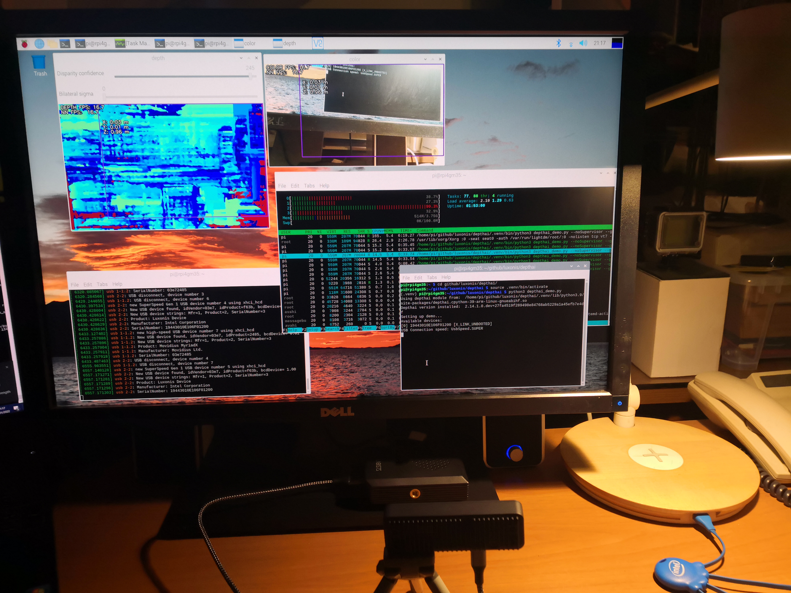

# HOWTO Install DepthAI on a Raspberry Pi 4B for the ARNEIS project

<!-- (2022-01-12 07:44 CET) -->

## Introduction

The following document explains how to install [Luxonis DepthAI](https://github.com/luxonis/depthai) software on a Raspberry Pi for the [ARNEIS project](https://github.com/B-AROL-O/ARNEIS).

## Prerequisites

* One [Raspberry Pi](https://www.raspberrypi.org/) prepared as detailed in "[HOWTO Install DepthAI on a Raspberry Pi 4B for the ARNEIS project](https://arneis.readthedocs.io/en/latest/howto/howto-prepare-rpi4b-for-arneis.html)".
  - Tested on rpi4gm35 ([Raspberry Pi 4B 4GB](https://www.amazon.com/Raspberry-Model-2019-Quad-Bluetooth/dp/B07TC2BK1X))
* One MicroSD card of at least 4GB.
  - **IMPORTANT**: The card should be blank, or at least should not contain any important data since it will be completely erased.
  - Tested with a [SanDisk Ultra 256 GB MicroSDXC](https://www.amazon.it/SanDisk-microSDXC-adattatore-prestazioni-Rosso-Grigio/dp/B08GY8NHF2)
* One desktop PC or laptop for formatting the SD card and controlling the RPi
  - OS: A recent version of Windows or Linux or macOS
  - The PC should have a MicroSDHC card reader.
    Alternatively, an additional USB MicroSD card reader is required
* Fast internet connection

## Step-by-step instructions

### Prepare the Raspberry Pi

Follow the instructions at <https://arneis.readthedocs.io/en/latest/howto/howto-prepare-rpi4b-for-arneis.html>.

### Install DepthAI

<!-- (2022-01-20 09:51 CET) -->

Reference: <https://docs.luxonis.com/en/latest/pages/tutorials/first_steps>

Logged in as `pi@rpi4gm35`, type the following command to install DepthAI software:

```bash
sudo apt update
sudo apt install -y python3-pip python3-venv

mkdir -p ~/github/luxonis
cd ~/github/luxonis
git clone https://github.com/luxonis/depthai.git
```

Now create a Python virtualenv:

```bash
cd ~/github/luxonis/depthai
python3 -m venv virtualenv
source virtualenv/bin/activate
pip install -U pip
```

Install requirements:

```bash
python3 install_requirements.py
```

Install some missing binary packages (for some unknown reasons neither pip nor virtualenv automatically install them)

```bash
sudo apt-get -y install libatlas-base-dev python3-h5py
```

Add a new udev rule for the script to be able to access the OAK-D-Lite device correctly.

```bash
echo 'SUBSYSTEM=="usb", ATTRS{idVendor}=="03e7", MODE="0666"' \
    | sudo tee /etc/udev/rules.d/80-movidius.rules
sudo udevadm control --reload-rules \
    && sudo udevadm trigger
```

Check Linux kernel messages

```bash
sudo dmesg -w
```

Connect the OAK-D-Lite to one USB 3.0 port of the Raspberry Pi using a USB 3.0 cable (USB-A to USB-C).

As soon as the OAK-D-Lite gets recognize the following messages should be displyed on the kernel log:

```text
[ 5253.298901] usb 1-1.2: new high-speed USB device number 4 using xhci_hcd
[ 5253.429951] usb 1-1.2: New USB device found, idVendor=03e7, idProduct=2485, bcdDevice= 0.01
[ 5253.429971] usb 1-1.2: New USB device strings: Mfr=1, Product=2, SerialNumber=3
[ 5253.429987] usb 1-1.2: Product: Movidius MyriadX
[ 5253.430002] usb 1-1.2: Manufacturer: Movidius Ltd.
[ 5253.430017] usb 1-1.2: SerialNumber: 03e72485
```

Run the demo script

```bash
python3 depthai_demo.py
```

Result: The `depthai_demo.py` program is executed correctly on the Raspberry Pi.



#### Note 1: First execution of depthai_demo.py

The first time that `depthai_demo.py` is launched, it may take a few minutes before the camera windows are be displayed.

#### Note 2: Launching depthai_demo.py from a remote shell

The `depthai_demo.py` script should be invoked from a terminal on the main Raspberry Pi display.

If the command is invoked from a remote SSH shell, make sure that the `DISPLAY` environment variable is properly set before launching the demo script.

Example:

```text
(.venv) pi@rpird102:~/github/luxonis/depthai $ export DISPLAY=:0.0
(.venv) pi@rpird102:~/github/luxonis/depthai $ python3 depthai_demo.py
Using depthai module from:  /home/pi/github/luxonis/depthai/.venv/lib/python3.7/site-packages/depthai.cpython-37m-arm-linux-gnueabihf.so
Depthai version installed:  2.14.1.0.dev+27fa4519f289498e84768ab5229a1a45efb7e4df
Setting up demo...
Available devices:
[0] 19443010E106F01200 [X_LINK_UNBOOTED]
USB Connection speed: UsbSpeed.SUPER
```

<!-- EOF -->
