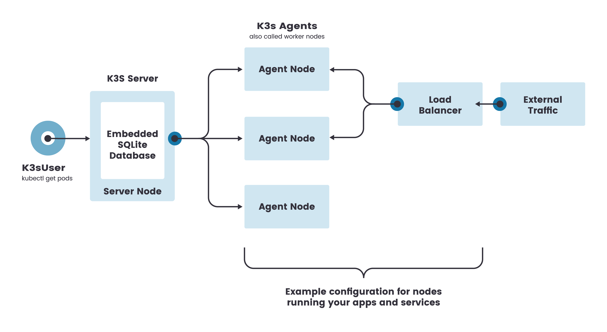

# HOWTO Install a K3s cluster for the ARNEIS project

<!-- (2022-01-31 16:30 CET) -->

## Introduction

This document explains how to install a [K3s](https://k3s.io/) cluster to be used for the ARNEIS project.

K3s (or "Lightweight Kubernetes") is a simplified installation of the Kubernetes distribution built for IoT and Edge computing.

K3s is an Open Source project started and maintained by [Rancher.com](https://rancher.com/).

### Architecture

The following diagram shows a possible deployment of the K3s architecture:



(Image credits: <https://rancher.com/docs/k3s/latest/en/architecture/>)

The main host (previously called "master" in Kubernetes literature) will act as both a K3s Server and an Agent (worker) Node. This is the smallest possible deployment of a K3s cluster. Additionally, other machines - either physical or virtual - may be added to the topology to act as Agent Nodes, thus adding redundancy and increasing the computation and storage capacity of the cluster.

### References

* [Rancher docs](https://rancher.com/docs/)
* [K3S Installation](https://rancher.com/docs/k3s/latest/en/installation/) - from rancher.com/docs

## Prerequisites

### Host acting as K3s Server

* Administrative login to a host (physical or virtual) with the following minimum requirements
  - CPU: min 2 cores
  - RAM: min 16 GiB
  - Disk: min 8 GiB SSD
  - OS: Ubuntu server 20.04 LTS
  - Fast internet connection (for updating OS and installing software)
  - Firewall configured to accept incoming ports:
    - 22/tcp (SSH)
    - 80/tcp (HTTP)
    - 443/tcp (HTTPS)
    - 6443/tcp,udp (Kubernetes API server)
  - Tested on arneis-vm01 (Virtual Machine on Azure Cloud - See [documentation](howto-create-vm-on-azure.md))

### Host(s) acting as Agent Node(s)

* Administrative login to a host (physical or virtual) with the following minimum requirements
  - TODO
  - Tested on rpi4gm35 (Raspberry Pi 4B - See [documentation](howto-prepare-rpi4b-for-arneis.md))

## Step-by-step instructions

### Install k3s on the main node

Logged in as root@arneis-vm01, install k3s

```bash
curl -sfL https://get.k3s.io | sh -
```

Result:

```text
root@arneis-vm01:~# curl -sfL https://get.k3s.io | sh -
[INFO]  Finding release for channel stable
[INFO]  Using v1.22.5+k3s1 as release
[INFO]  Downloading hash https://github.com/k3s-io/k3s/releases/download/v1.22.5+k3s1/sha256sum-amd64.txt
[INFO]  Downloading binary https://github.com/k3s-io/k3s/releases/download/v1.22.5+k3s1/k3s
[INFO]  Verifying binary download
[INFO]  Installing k3s to /usr/local/bin/k3s
[INFO]  Skipping installation of SELinux RPM
[INFO]  Creating /usr/local/bin/kubectl symlink to k3s
[INFO]  Creating /usr/local/bin/crictl symlink to k3s
[INFO]  Creating /usr/local/bin/ctr symlink to k3s
[INFO]  Creating killall script /usr/local/bin/k3s-killall.sh
[INFO]  Creating uninstall script /usr/local/bin/k3s-uninstall.sh
[INFO]  env: Creating environment file /etc/systemd/system/k3s.service.env
[INFO]  systemd: Creating service file /etc/systemd/system/k3s.service
[INFO]  systemd: Enabling k3s unit
Created symlink /etc/systemd/system/multi-user.target.wants/k3s.service → /etc/systemd/system/k3s.service.
[INFO]  systemd: Starting k3s
root@arneis-vm01:~#
```

Verify that after a few minutes all the k3s services are up and running

```bash
kubectl get nodes
kubectl get all --all-namespaces
```

Result

```text
root@arneis-vm01:~# kubectl get all --all-namespaces
NAMESPACE     NAME                                         READY   STATUS      RESTARTS   AGE
kube-system   pod/coredns-85cb69466-7gm6x                  1/1     Running     0          2m49s
kube-system   pod/metrics-server-9cf544f65-ztddz           1/1     Running     0          2m49s
kube-system   pod/local-path-provisioner-64ffb68fd-g4cgw   1/1     Running     0          2m49s
kube-system   pod/helm-install-traefik-crd--1-fgbjx        0/1     Completed   0          2m50s
kube-system   pod/helm-install-traefik--1-w6c9h            0/1     Completed   2          2m50s
kube-system   pod/svclb-traefik-bdvfw                      2/2     Running     0          2m11s
kube-system   pod/traefik-786ff64748-9w7v6                 1/1     Running     0          2m12s

NAMESPACE     NAME                     TYPE           CLUSTER-IP     EXTERNAL-IP   PORT(S)                      AGE
default       service/kubernetes       ClusterIP      10.43.0.1      <none>        443/TCP                      3m4s
kube-system   service/kube-dns         ClusterIP      10.43.0.10     <none>        53/UDP,53/TCP,9153/TCP       3m
kube-system   service/metrics-server   ClusterIP      10.43.46.89    <none>        443/TCP                      2m59s
kube-system   service/traefik          LoadBalancer   10.43.193.71   10.0.0.4      80:32593/TCP,443:30697/TCP   2m12s

NAMESPACE     NAME                           DESIRED   CURRENT   READY   UP-TO-DATE   AVAILABLE   NODE SELECTOR   AGE
kube-system   daemonset.apps/svclb-traefik   1         1         1       1            1           <none>          2m11s

NAMESPACE     NAME                                     READY   UP-TO-DATE   AVAILABLE   AGE
kube-system   deployment.apps/coredns                  1/1     1            1           3m
kube-system   deployment.apps/metrics-server           1/1     1            1           3m
kube-system   deployment.apps/local-path-provisioner   1/1     1            1           3m
kube-system   deployment.apps/traefik                  1/1     1            1           2m12s

NAMESPACE     NAME                                               DESIRED   CURRENT   READY   AGE
kube-system   replicaset.apps/coredns-85cb69466                  1         1         1       2m49s
kube-system   replicaset.apps/metrics-server-9cf544f65           1         1         1       2m49s
kube-system   replicaset.apps/local-path-provisioner-64ffb68fd   1         1         1       2m49s
kube-system   replicaset.apps/traefik-786ff64748                 1         1         1       2m12s

NAMESPACE     NAME                                 COMPLETIONS   DURATION   AGE
kube-system   job.batch/helm-install-traefik-crd   1/1           23s        2m58s
kube-system   job.batch/helm-install-traefik       1/1           39s        2m58s
root@arneis-vm01:~#
```

### Running a sample Pod on the cluster

TODO

Logged in as `root@arneis-vm01`, create the following file `test.yaml`

```yaml
apiVersion: v1
kind: Pod
metadata:
  name: busybox-sleep
spec:
  containers:
  - name: busybox
    image: busybox
    args:
    - sleep
    - "1000000"
```

then run `kubectl apply -f test.yaml`:

```bash
kubectl apply -f test.yaml
```

Result:

```text
TODO
```

### Verify accessibility of the k3s API server from the Agent Node

Logged in as `user@<agent-node>` try to access <https://master-node:6443/>

#### Example 1 (using curl)

Command:

```bash
curl https://arneis-vm01.gmacario.it:6443/
```

Result:

```text
root@hw0929:~# curl https://arneis-vm01.gmacario.it:6443/
curl: (60) SSL certificate problem: unable to get local issuer certificate
More details here: https://curl.se/docs/sslcerts.html

curl failed to verify the legitimacy of the server and therefore could not
establish a secure connection to it. To learn more about this situation and
how to fix it, please visit the web page mentioned above.
root@hw0929:~#
```

TODO

#### Example 2 (using a browser)

If you access the K3S API URL from a browser, the following error (on Firefox, you should have a similar error message on other browsers) will let you know that the K3S Server has a self-signed TLS certificate:


If so, click "Advanced..."


then click "Accept the Risk and Continue".

Once you passed the self-signed certificate warning, you should receive a 401 (Unauthorized) error, but this is correct since we did not provide the node-token - see below.


### Install k3s on the Agent Node(s)

Now that our k3s Server is up and running we are ready to attach additional Agent Node(s) to the cluster.

Let's first try attach host `hw0929` (Ubuntu 21.10)

```text
gmacario@hw0929:~$ cat /etc/os-release 
PRETTY_NAME="Ubuntu 21.10"
NAME="Ubuntu"
VERSION_ID="21.10"
VERSION="21.10 (Impish Indri)"
VERSION_CODENAME=impish
ID=ubuntu
ID_LIKE=debian
HOME_URL="https://www.ubuntu.com/"
SUPPORT_URL="https://help.ubuntu.com/"
BUG_REPORT_URL="https://bugs.launchpad.net/ubuntu/"
PRIVACY_POLICY_URL="https://www.ubuntu.com/legal/terms-and-policies/privacy-policy"
UBUNTU_CODENAME=impish
gmacario@hw0929:~$
```

#### Obtain the cluster node-token

The node-token is saved in a file under the folder `/var/lib/rancher/k3s/server` of the k3s server.

Logged in as `root@arneis-vm01`, display the k3s node-token with the following command:

```bash
cat /var/lib/rancher/k3s/server/node-token
```

Result (for security reasons the node-token has been partially anonymized)

```text
root@arneis-vm01:~# cat /var/lib/rancher/k3s/server/node-token
K1009b40xxxxxxxxxxxxxxxxxxxxxxxxxxxxxxxxxxxxxxxxxxxxxxxxxxd8e16a40::server:f807xxxxxxxxxxxxxxxxxxxxxxxx9f5f
root@arneis-vm01:~#
```

#### Attach the Agent Node

Logged in as `root@<agent-node>` (in our example, `root@hw0929`) type the following commands to install the required software on the node and connect it to the k3s Server:

```bash
export K3S_URL=https://myserver:6443
export K3S_TOKEN=mynodetoken
curl -sfL https://get.k3s.io | sh -
```

replacing

* `myserver` --> `arneis-vm01.gmacario.it`
* `mynodetoken` --> (node-token obtained with the commands shown in the previous section)

Result:

```text
root@hw0929:~# curl -sfL https://get.k3s.io | sh -
[INFO]  Finding release for channel stable
[INFO]  Using v1.22.6+k3s1 as release
[INFO]  Downloading hash https://github.com/k3s-io/k3s/releases/download/v1.22.6+k3s1/sha256sum-amd64.txt
root@hw0929:~#
```

**TODO**: The command does not seem to complete successfully.

#### Troubleshooting the script

Let's retry adding the `-x` option to `sh`:

```text
root@hw0929:~# curl -sfL https://get.k3s.io | sh -x -
+ set -e
+ set -o noglob
+ GITHUB_URL=https://github.com/k3s-io/k3s/releases
+ STORAGE_URL=https://storage.googleapis.com/k3s-ci-builds
+ DOWNLOADER=
+ escape 
+ printf %s 
+ sed -e s/\([][!#$%&()*;<=>?\_`{|}]\)/\\\1/g;
+ quote
+ eval set --
+ set --
+ verify_system
+ [ -x /sbin/openrc-run ]
+ [ -x /bin/systemctl ]
+ HAS_SYSTEMD=true
+ return
+ setup_env
+ [ -z https://arneis-vm01.gmacario.it:6443 ]
+ [ -z K1009bxxxxxxxxxxxxxxxxxxxxxxxxxxxxxx26d8e16a40::server:f807dxxxxxxxxxxxxxxx9f5f ]
+ CMD_K3S=agent
+ verify_k3s_url
+ quote_indent
+ printf  \\\n
+ CMD_K3S_EXEC=agent \
+ [ -n  ]
+ [ agent = server ]
+ SYSTEM_NAME=k3s-agent
+ printf %s k3s-agent
+ sed -e s/[][!#$%&()*;<=>?\_`{|}/[:space:]]/^/g;
+ valid_chars=k3s-agent
+ [ k3s-agent != k3s-agent ]
+ SUDO=sudo
+ id -u
+ [ 0 -eq 0 ]
+ SUDO=
+ [ -n  ]
+ [ agent = server ]
+ SYSTEMD_TYPE=exec
+ [ -n  ]
+ BIN_DIR=/usr/local/bin
+ sh -c touch /usr/local/bin/k3s-ro-test && rm -rf /usr/local/bin/k3s-ro-test
+ [ -n  ]
+ SYSTEMD_DIR=/etc/systemd/system
+ SERVICE_K3S=k3s-agent.service
+ UNINSTALL_K3S_SH=/usr/local/bin/k3s-agent-uninstall.sh
+ KILLALL_K3S_SH=/usr/local/bin/k3s-killall.sh
+ [ true = true ]
+ FILE_K3S_SERVICE=/etc/systemd/system/k3s-agent.service
+ FILE_K3S_ENV=/etc/systemd/system/k3s-agent.service.env
+ get_installed_hashes
+ sha256sum /usr/local/bin/k3s /etc/systemd/system/k3s-agent.service /etc/systemd/system/k3s-agent.service.env
+ true
+ PRE_INSTALL_HASHES=sha256sum: /usr/local/bin/k3s: No such file or directory
sha256sum: /etc/systemd/system/k3s-agent.service: No such file or directory
sha256sum: /etc/systemd/system/k3s-agent.service.env: No such file or directory
+ [  = true ]
+ INSTALL_K3S_CHANNEL_URL=https://update.k3s.io/v1-release/channels
+ INSTALL_K3S_CHANNEL=stable
+ download_and_verify
+ can_skip_download
+ [  != true ]
+ return 1
+ setup_verify_arch
+ [ -z  ]
+ uname -m
+ ARCH=x86_64
+ ARCH=amd64
+ SUFFIX=
+ verify_downloader curl
+ command -v curl
+ [ -x /snap/bin/curl ]
+ DOWNLOADER=curl
+ return 0
+ setup_tmp
+ mktemp -d -t k3s-install.XXXXXXXXXX
+ TMP_DIR=/tmp/k3s-install.05Pykak7Yf
+ TMP_HASH=/tmp/k3s-install.05Pykak7Yf/k3s.hash
+ TMP_BIN=/tmp/k3s-install.05Pykak7Yf/k3s.bin
+ trap cleanup INT EXIT
+ get_release_version
+ [ -n  ]
+ [ -n  ]
+ info Finding release for channel stable
+ echo [INFO]  Finding release for channel stable
[INFO]  Finding release for channel stable
+ version_url=https://update.k3s.io/v1-release/channels/stable
+ curl -w %{url_effective} -L -s -S https://update.k3s.io/v1-release/channels/stable -o /dev/null
+ sed -e s|.*/||
+ VERSION_K3S=v1.22.6+k3s1
+ info Using v1.22.6+k3s1 as release
+ echo [INFO]  Using v1.22.6+k3s1 as release
[INFO]  Using v1.22.6+k3s1 as release
+ download_hash
+ [ -n  ]
+ HASH_URL=https://github.com/k3s-io/k3s/releases/download/v1.22.6+k3s1/sha256sum-amd64.txt
+ info Downloading hash https://github.com/k3s-io/k3s/releases/download/v1.22.6+k3s1/sha256sum-amd64.txt
+ echo [INFO]  Downloading hash https://github.com/k3s-io/k3s/releases/download/v1.22.6+k3s1/sha256sum-amd64.txt
[INFO]  Downloading hash https://github.com/k3s-io/k3s/releases/download/v1.22.6+k3s1/sha256sum-amd64.txt
+ download /tmp/k3s-install.05Pykak7Yf/k3s.hash https://github.com/k3s-io/k3s/releases/download/v1.22.6+k3s1/sha256sum-amd64.txt
+ [ 2 -eq 2 ]
+ curl -o /tmp/k3s-install.05Pykak7Yf/k3s.hash -sfL https://github.com/k3s-io/k3s/releases/download/v1.22.6+k3s1/sha256sum-amd64.txt
+ cleanup
+ code=23
+ set +e
+ trap - EXIT
+ rm -rf /tmp/k3s-install.05Pykak7Yf
+ exit 23
root@hw0929:~#
```

TODO: Maybe is this related to unknown certificate?

#### Testing using server IP address rather than FQDN

<!-- (2022-02-02 12:00 CET) -->

```bash
export K3S_URL=https://20.124.132.35:6433
export K3S_TOKEN=K100xxxxxxx
curl -sfL https://get.k3s.io | sh -
```

Result:

```text
root@hw0929:~# curl -sfL https://get.k3s.io | sh -
[INFO]  Finding release for channel stable
[INFO]  Using v1.22.6+k3s1 as release
[INFO]  Downloading hash https://github.com/k3s-io/k3s/releases/download/v1.22.6+k3s1/sha256sum-amd64.txt
root@hw0929:~#
```

TODO: Check whether Ubuntu 21.10 is a supported OS


```text
root@hw0929:~# cat /etc/os-release 
PRETTY_NAME="Ubuntu 21.10"
NAME="Ubuntu"
VERSION_ID="21.10"
VERSION="21.10 (Impish Indri)"
VERSION_CODENAME=impish
ID=ubuntu
ID_LIKE=debian
HOME_URL="https://www.ubuntu.com/"
SUPPORT_URL="https://help.ubuntu.com/"
BUG_REPORT_URL="https://bugs.launchpad.net/ubuntu/"
PRIVACY_POLICY_URL="https://www.ubuntu.com/legal/terms-and-policies/privacy-policy"
UBUNTU_CODENAME=impish
root@hw0929:~#
```

TODO: Try on udoox86gm1 (Ubuntu 20.04.x LTS 64-bit)

TODO: Notice that versions do conflict

* arneis-vm01 installed k3s v1.22.5+k3s1
* the Agent Node is attempting to install k3s v1.22.6+k3s1

TODO

<!-- EOF -->
