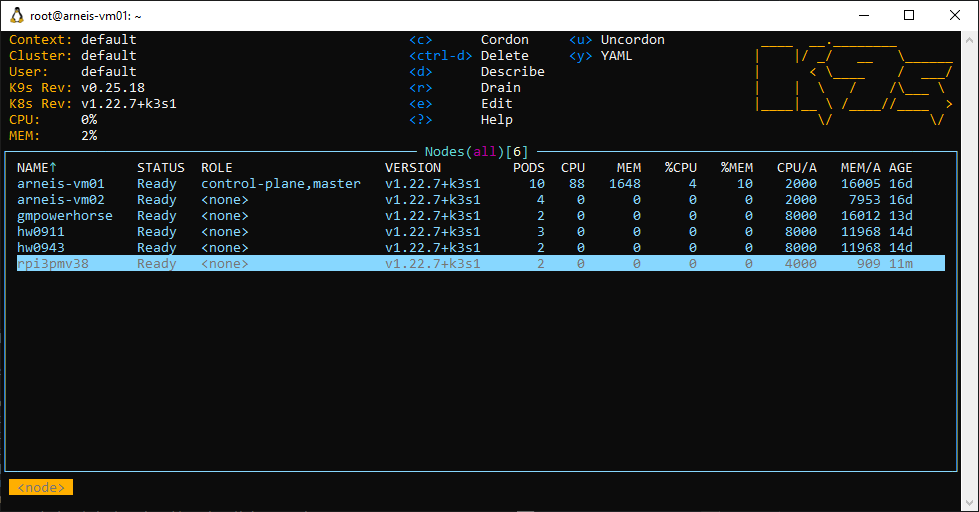
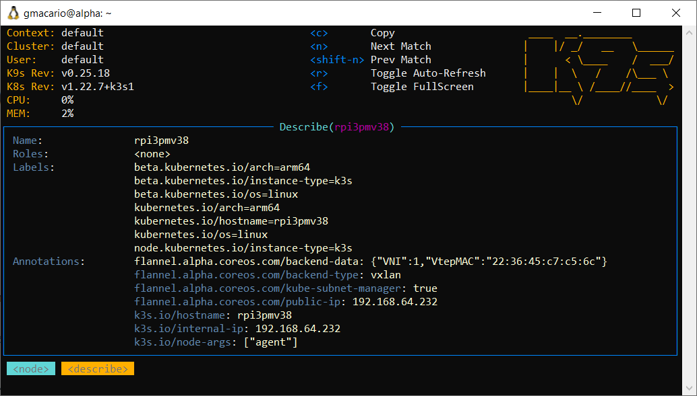

# HOWTO Install Raspberry Pi OS 64-bit for the ARNEIS project

## Introduction

TODO

## Prerequisites

TODO

## Install base Operating System

TODO

## Make the Raspberry Pi an agent node of a k3s cluster

### Make sure the OS is up-to-date

<!-- (2022-03-26 08:49 CET) -->

```text
gmacario@HW2457:~$ ssh pi@rpi3pmv38.local
Linux rpi3pmv38 5.10.103-v8+ #1530 SMP PREEMPT Tue Mar 8 13:06:35 GMT 2022 aarch64

The programs included with the Debian GNU/Linux system are free software;
the exact distribution terms for each program are described in the
individual files in /usr/share/doc/*/copyright.

Debian GNU/Linux comes with ABSOLUTELY NO WARRANTY, to the extent
permitted by applicable law.
Last login: Sat Mar 26 08:48:24 2022 from 192.168.64.105
pi@rpi3pmv38:~ $ sudo apt update && sudo apt -y dist-upgrade && sudo apt -y autoremove --purge
Hit:1 http://archive.raspberrypi.org/debian bullseye InRelease
Hit:2 http://deb.debian.org/debian bullseye InRelease
Hit:3 http://deb.debian.org/debian bullseye-updates InRelease
Hit:4 http://security.debian.org/debian-security bullseye-security InRelease
Reading package lists... Done
Building dependency tree... Done
Reading state information... Done
All packages are up to date.
Reading package lists... Done
Building dependency tree... Done
Reading state information... Done
Calculating upgrade... Done
0 upgraded, 0 newly installed, 0 to remove and 0 not upgraded.
Reading package lists... Done
Building dependency tree... Done
Reading state information... Done
0 upgraded, 0 newly installed, 0 to remove and 0 not upgraded.
pi@rpi3pmv38:~ $
```

### Attach Agent Node

<!-- (2022-03-26 08:49 CET) -->

```text
pi@rpi3pmv38:~ $ sudo -i
root@rpi3pmv38:~# export K3S_URL=https://xxxx.example.com:6443
root@rpi3pmv38:~# export K3S_TOKEN=K1015exxxxxxxxxxxxxxxxxxxxxxxxxxxxxxxxxxxxxxxxxxxxxxxxxxxxxxxf06408::server:f22587xxxxxxxxxxxxxxxxxxxx8672c3
root@rpi3pmv38:~# curl -sfL https://get.k3s.io | sh -
[INFO]  Finding release for channel stable
[INFO]  Using v1.22.7+k3s1 as release
[INFO]  Downloading hash https://github.com/k3s-io/k3s/releases/download/v1.22.7+k3s1/sha256sum-arm64.txt
[INFO]  Downloading binary https://github.com/k3s-io/k3s/releases/download/v1.22.7+k3s1/k3s-arm64
[INFO]  Verifying binary download
[INFO]  Installing k3s to /usr/local/bin/k3s
[INFO]  Creating /usr/local/bin/kubectl symlink to k3s
[INFO]  Creating /usr/local/bin/crictl symlink to k3s
[INFO]  Creating /usr/local/bin/ctr symlink to k3s
[INFO]  Creating killall script /usr/local/bin/k3s-killall.sh
[INFO]  Creating uninstall script /usr/local/bin/k3s-agent-uninstall.sh
[INFO]  env: Creating environment file /etc/systemd/system/k3s-agent.service.env
[INFO]  systemd: Creating service file /etc/systemd/system/k3s-agent.service
[INFO]  Failed to find memory cgroup, you may need to add "cgroup_memory=1 cgroup_enable=memory" to your linux cmdline (/boot/cmdline.txt on a Raspberry Pi)
[INFO]  systemd: Enabling k3s-agent unit
Created symlink /etc/systemd/system/multi-user.target.wants/k3s-agent.service → /etc/systemd/system/k3s-agent.service.
[INFO]  systemd: Starting k3s-agent
root@rpi3pmv38:~#
```

The following line gives us some suggestions:

```text
[INFO]  Failed to find memory cgroup, you may need to add "cgroup_memory=1 cgroup_enable=memory" to your linux cmdline (/boot/cmdline.txt on a Raspberry Pi)
```

#### Modify Linux cmdline

Display the current contents of file `/boot/cmdline.txt`:

```text
root@rpi3pmv38:~# cat /boot/cmdline.txt
console=serial0,115200 console=tty1 root=PARTUUID=ff8e3abf-02 rootfstype=ext4 fsck.repair=yes rootwait quiet splash plymouth.ignore-serial-consoles
root@rpi3pmv38:~#
```

Edit the boot configuration file according to the suggestions in the previous error message

```bash
sudo vi /boot/cmdline.txt
```

Finally, verify that the command-line has changed accordingly:

```text
root@rpi3pmv38:~# cat /boot/cmdline.txt
console=serial0,115200 console=tty1 root=PARTUUID=ff8e3abf-02 rootfstype=ext4 fsck.repair=yes rootwait quiet splash plymouth.ignore-serial-consoles cgroup_memory=1 cgroup_enable=memory
root@rpi3pmv38:~#
```

Reboot to ensure that the Linux kernel will use the updated command-line.

After the Raspberry Pi has rebooted you may inspect the Linux command-line with the following command:

```text
pi@rpi3pmv38:~ $ cat /proc/cmdline
coherent_pool=1M 8250.nr_uarts=0 snd_bcm2835.enable_compat_alsa=0 snd_bcm2835.enable_hdmi=1 video=HDMI-A-1:1920x1080M@60 vc_mem.mem_base=0x3ec00000 vc_mem.mem_size=0x40000000  console=ttyS0,115200 console=tty1 root=PARTUUID=ff8e3abf-02 rootfstype=ext4 fsck.repair=yes rootwait quiet splash plymouth.ignore-serial-consoles cgroup_memory=1 cgroup_enable=memory
pi@rpi3pmv38:~ $
```

#### Retry attaching Agent Node

<!-- (2022-03-26 10:14 CET) -->

```text
pi@rpi3pmv38:~ $ sudo -i
root@rpi3pmv38:~# export K3S_URL=https://xxxx.example.com:6443
root@rpi3pmv38:~# export K3S_TOKEN=K1015exxxxxxxxxxxxxxxxxxxxxxxxxxxxxxxxxxxxxxxxxxxxxxxxxxxxxxxf06408::server:f22587xxxxxxxxxxxxxxxxxxxx8672c3
root@rpi3pmv38:~# curl -sfL https://get.k3s.io | sh -
[INFO]  Finding release for channel stable
[INFO]  Using v1.22.7+k3s1 as release
[INFO]  Downloading hash https://github.com/k3s-io/k3s/releases/download/v1.22.7+k3s1/sha256sum-arm64.txt
[INFO]  Skipping binary downloaded, installed k3s matches hash
[INFO]  Skipping /usr/local/bin/kubectl symlink to k3s, already exists
[INFO]  Skipping /usr/local/bin/crictl symlink to k3s, already exists
[INFO]  Skipping /usr/local/bin/ctr symlink to k3s, already exists
[INFO]  Creating killall script /usr/local/bin/k3s-killall.sh
[INFO]  Creating uninstall script /usr/local/bin/k3s-agent-uninstall.sh
[INFO]  env: Creating environment file /etc/systemd/system/k3s-agent.service.env
[INFO]  systemd: Creating service file /etc/systemd/system/k3s-agent.service
[INFO]  systemd: Enabling k3s-agent unit
Created symlink /etc/systemd/system/multi-user.target.wants/k3s-agent.service → /etc/systemd/system/k3s-agent.service.
[INFO]  No change detected so skipping service start
root@rpi3pmv38:~#
```

#### Verify that the Agent Node is up-and-running

Verify the cluster configuration using `kubectl`

```bash
kubectl get nodes
```

then read the online help to understand how to display the properties of the new node.

If you have [k9s - the Kubernetes CLI](https://k9scli.io/) installed, the procedure is even more intuitive:

```bash
k9s
```

As soon as the k9s main window is displayed, type "`:node`" then press **Enter** to view the list of nodes which are part of the cluster.



If everything works as expected, after a few seconds your new node should show up in the Nodes view.

Use the Up and Down arrows to select that node (in our case, `rpi3pmv38`), then type "`d`" to describe the node:



Make sure that label `beta.kubernetes.io/arch` is set to `arm64`.

TODO

<!-- EOF -->
