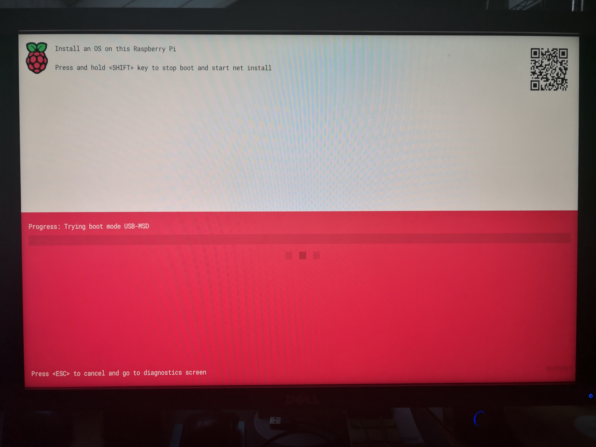
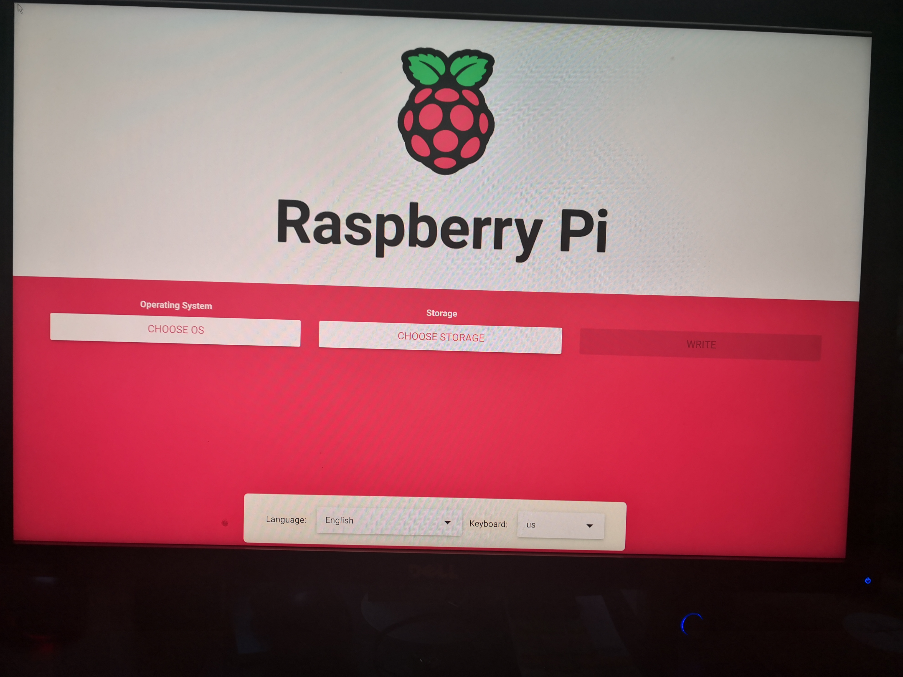

# HOWTO Install Raspberry Pi OS 64-bit for the ARNEIS project

## Introduction

This HOWTO documents how to install Raspberry Pi OS 64-bit on a Raspberry Pi 3B+ or higher to be used as an Edge Controller of the ARNEIS project.

## Reference documents

* [No PC Needed: How to Install Raspberry Pi OS Over the Internet](https://www.tomshardware.com/how-to/raspberry-pi-network-install) - Tom's Hardware, 2022-02-12

## Prerequisites

* One [Raspberry Pi](https://www.raspberrypi.org/).
  - Tested on rpi4gm35 ([Raspberry Pi 4B 4GB](https://www.amazon.com/Raspberry-Model-2019-Quad-Bluetooth/dp/B07TC2BK1X))
* One MicroSD card of at least 4GB.
  - **IMPORTANT**: The card should be blank, or at least should not contain any important data since it will be completely erased.
  - Tested with a [SanDisk Ultra 256 GB MicroSDXC](https://www.amazon.it/SanDisk-microSDXC-adattatore-prestazioni-Rosso-Grigio/dp/B08GY8NHF2)
* One desktop PC or laptop for formatting the SD card and controlling the RPi
  - OS: A recent version of Windows or Linux or macOS
  - The PC should have a MicroSDHC card reader.
    Alternatively, an additional USB MicroSD card reader is required
* Fast internet connection

## Install base Operating System

The installation of [Raspbian Pi OS 64-bit](https://www.raspberrypi.com/software/) is performed through the following tests:

1. Update the Bootloader of the Raspberry Pi
2. Prepare a MicroSD card with Raspberry Pi OS
3. TODO (See below)

Each of thosee steps above is described in more details in the corresponding chapter down below.

### Install Raspberry Pi Imager

Launch a browser on your laptop and open <https://www.raspberrypi.com/software/>

Download [Raspberry Pi Imager](https://www.raspberrypi.com/software/) and install it on your laptop.

Make sure you are running the latest version (1.7.2 at the time of this writing).

### Update the Bootloader of the Raspberry Pi

Launch Raspberry Pi imager.

Insert a MicroSD card into one slot of your laptop.
Alternatively, insert the MicroSD into the USB card reader, then plug the USB card reader into one empty USB port of your laptop.

Choose Operating System: Misc utility images > Beta Test Bootloader > SD Card Boot

* Boot from SD Card if available, otherwise boot from USB
* Released: 2022-02-28
* Online - 0.0 GB download

Choose Storage: (select MicroSDHC)

Click "Write" to write the MicroSD card with the selected image.

Insert the MicroSDHC and power up the Raspberry Pi.

Wait until the Bootloader is updated, then remove power from the Raspberry Pi.

Remove the MicroSDHC and power up the Raspberry Pi.
The updated bootloader should be displayed.



### Prepare a MicroSD card with Raspberry Pi OS

Make sure the Ethernet cable is connected.

Press and hold the SHIFT key to stop boot and start net install. The Raspberry Pi imager will be executed on the Raspberry Pi.



**NOTE**: If you are using an older version of Raspberry Pi which does not support the updated bootloader, you may always prepare the MicroSD card running Raspberry Pi imager on the laptop and following similar instructions to what described in this section.

Insert a MicroSD card into the Raspberry Pi.

Choose Language and Keyboard.

Choose Operating System: Raspberry Pi OS (other) > Raspberry Pi OS (64-bit)

* A port of Debian Bullseye with the Raspberry Pi Desktop (Compatible with Raspberry Pi 3/4/400)
* Released: 2022-04-04
* Online - 0.7 GB download

Choose Storage: Internal SD card reader - 31.3 GB

Click on the "cog" icon to open the Advanced options dialog box

> Image customization options: for this session only
>
> * [x] Set hostname: `rpird102`.local
> * [x] Enable SSH
>   - Use password authentication: Yes
>   - Allow public-key authentication only
> * [x] Set username and password
>   - Username: `pi`
>   - Password: `xxxx`
> * [x] Configure wireless LAN
>   - SSID: `xxxx`
>   - Hidden SSID: No
>   - Password: `yyyy`
>   - Wireless LAN country: IT
> * [x] Set locale settings
>   - Time zone: Europe/Rome
>   - Keyboard layout: it
>
> Persistent settings
>
> * [ ] Play sound when finished
> * [x] Eject media when finished
> * [x] Enable telemetry

then click "SAVE".

Click "WRITE" to download the image and write it to the MicroSDHC.

> **Warning**
>
> All existing data on 'Internal SD card reader' will be erased.
> Are you sure you want to continue?
>
> [NO](https://github.com/) | [SI](https://github.com/)

Click "YES".

TODO TODO TODO

...

> **Scrittura completata senza errori**
>
> Scrittura di **Raspberry Pi OS (32-bit)** in **MXT-USB Storage Device USB Device** completata.
>
> Ora puoi rimuovere la scheda SD dal lettore
>
> [CONTINUA](https://github.com/)

Remove the MicroSD from your laptop

### First boot of the RPi with the new MicroSD card

(2022-01-12 08:35 CET)

* Insert the MicroSD card into your Raspberry Pi.
* Connect a display using a MicroHDMI-to-HDMI cable
* Connect a USB keyboard to the first USB 2.0 port of the RPi4
* Connect a USB mouse to the second USB 2.0 port of the RPi4
* Connect a 5Vdc, 3A power supply to the USB-C port of the RPi4

Turn on the power supply and wait for Raspberry Pi OS to boot.

> **Welcome to Raspberry Pi**
>
> Welcome to the Raspberry Pi Desktop!
>
> Before you start usin it, there are a few things to set up.
>
> Press 'Next' to get started.
>
> [Cancel](https://github.com/) | [Next](https://github.com/)

Click "Next".

> **Set Country**
>
> Enter the details of your location.
> This is used to set the language, time zone, keyboard and other international settings.
>
> * Country: Italy
> * Language: Italian
> * Timezone: Rome
>
> * [x] Use English language
> * [ ] Use US keyboard
>
> Press 'Next' when you have made your selection.
>
> [Back](https://github.com/) | [Next](https://github.com/)

Fill in the form as shown above, then click "Next"

...

> **Change Password**
>
> The default 'pi' user account currently has the password 'raspberry'.
> It is strongly recommended that you change this to a different
> password that only you know
>
> * Enter new password: xxxx
> * Confirm new password: xxx
>
> * [x] Hide characters
>
> Press 'Next' to activate your new passowrd.
>
> [Back](https://github.com/) | [Next](https://github.com/)

Fill in the form as instructed, then click "Next"

> **Set Up Screen**
>
> You should be able to set the taskbar along the top of the screen.
> Tick the box if some or all of it does not fit on the screen.
>
> [ ] The taskbar does not fit one the screen
>
> The change will take effect when the Pi is restarted.
>
> Press 'Next' to save your setting.
>
> [Back](https://github.com/) | [Next](https://github.com/)

Verify and update if needed, then click "Next".

> **Select WiFi Network**
>
> Select your WiFi network from the list.
>
> ...
>
> Press 'Next' to connect, or 'Skip' to continue without connecting.
>
> [Back](https://github.com/) | [Skip](https://github.com/) | [Next](https://github.com/)

Select the desired WiFi network, then click "Next".
If the select network is protected you will be requested the password

> **Enter WiFi Network**
>
> Enter the password for the WiFi network 'xxxx'.
>
> * Password: yyyy
>
> [x] Hide characters
>
> Press 'Next' to connect, or 'Skip' to continue without connecting.
>
> [Back](https://github.com/) | [Skip](https://github.com/) | [Next](https://github.com/)

Click "Next".

> **Update Software**
>
> The operating system and applications will now be checked and
> updated if necessary. This may involve a large download.
>
> Press 'Next' ...
>
> [Back](https://github.com/) | [Skip](https://github.com/) | [Next](https://github.com/)

Click "Next".

> Download updates - please wait.

When the update is complete the following popup should be displayed

> System is up to date
>
> [OK](https://github.com/)

Click "OK" to continue.

> **Setup Complete**
>
> Your Raspberry Pi is now set up and ready to go.
>
> To run applications, click the raspberry icon
> in the top left corner of the screen to open the menu.
>
> Press 'Restart' to restart your Pi so the new settings will take effect.
>
> [Back](https://github.com/) | [Later](https://github.com/) | [Restart](https://github.com/)

Click "Restart".

Verify that the RPi reboots correctly.


### Display assigned IP addresses

To know the IP addresses assigned to the Raspberry Pi just move the mouse over the network icon at the top right of the desktop


### Configure hostname, SSH and VNC

<!-- (2022-01-12 10:10 CET) -->

Open a terminal and type the following command

```bash
sudo raspi-config
```

* Select "1" (System Options), then "S4" (Hostname)
* Enter hostname: `rpi4gm35` (will replace default hostname `raspberrypi`)
* Select "3" (Interface Options), then "I2" (SSH)
* Select "Yes" to enable SSH
* Select "3" (Interface Options), then "I3" (VNC)
* Select "Yes" to enable VNC
* Select "Finish" to exit `raspi-config`. Reboot if requested

Verify that the RPi is accessible from the laptop via SSH and VNC
(you may need to scan the local Wi-Fi network to get the IPv4 address assigned by the router)

HINT: To scan the network and identify the open services you can use one of those tools

- The [Fing app](https://www.fing.com/) on a mobile phone or on your laptop.
- [nmap](https://nmap.org/)

It this works disconnect the USB keyboard, mouse and display


Reboot your RPi4 and verify that the device is still accessible from SSH:

```text
gpmacario@HW2457 MINGW64 ~
$ ssh pi@172.30.48.18
pi@172.30.48.18's password:
Linux rpi4gm35 5.10.63-v7l+ #1488 SMP Thu Nov 18 16:15:28 GMT 2021 armv7l

The programs included with the Debian GNU/Linux system are free software;
the exact distribution terms for each program are described in the
individual files in /usr/share/doc/*/copyright.

Debian GNU/Linux comes with ABSOLUTELY NO WARRANTY, to the extent
permitted by applicable law.
Last login: Wed Jan 12 16:36:38 2022
pi@rpi4gm35:~ $
```

Do the same using a VNC client (in my case I used the free to use [VNC&reg; Viewer](https://www.realvnc.com/en/connect/download/viewer/))


Double click on the selected profile to connect to the remote desktop of the Raspberry Pi:


### (Recommended) Create a public DNS entry

If you have administrative rights to a DNS zone you may choose to access your Raspberry Pi using a symbolic name rather than an IP address.

If so, access your DNS administrative page (in my case, <https://register.it/>) and create an A record to map the name to the IP address assigned to your Raspberry Pi.

In my case

> `A rpi4gm35 172.30.48.18`

Wait until the DNS zone is propagated, then verify that the device can be accessed by another host (in our case, our laptop) using the assigned name rather than its IP address:

```bash
gpmacario@HW2457 MINGW64 ~
$ ping rpi4gm35.gmacario.it

Esecuzione di Ping rpi4gm35.gmacario.it [172.30.48.18] con 32 byte di dati:
Risposta da 172.30.48.18: byte=32 durata=8ms TTL=64
Risposta da 172.30.48.18: byte=32 durata=7ms TTL=64
Risposta da 172.30.48.18: byte=32 durata=6ms TTL=64
Risposta da 172.30.48.18: byte=32 durata=6ms TTL=64

Statistiche Ping per 172.30.48.18:
    Pacchetti: Trasmessi = 4, Ricevuti = 4,
    Persi = 0 (0% persi),
Tempo approssimativo percorsi andata/ritorno in millisecondi:
    Minimo = 6ms, Massimo =  8ms, Medio =  6ms

gpmacario@HW2457 MINGW64 ~
$
```

### Configure public SSH keypair

Logged in as pi@rpi4gm35, create a public/private SSH keypair:

```bash
ssh-keygen
```

Type the following commands to be able to login to your Raspberry Pi through your public SSH key - for instance:

```bash
cat <<END >>~/.ssh/authorized_keys
ssh-rsa AAAAB3Nza....W1cG35r8= gpmacario@HW2457
END
```

Test


```bash
gpmacario@HW2457 MINGW64 ~
$ ssh pi@rpi4gm35.gmacario.it
Linux rpi4gm35 5.10.92-v7l+ #1514 SMP Mon Jan 17 17:38:03 GMT 2022 armv7l

The programs included with the Debian GNU/Linux system are free software;
the exact distribution terms for each program are described in the
individual files in /usr/share/doc/*/copyright.

Debian GNU/Linux comes with ABSOLUTELY NO WARRANTY, to the extent
permitted by applicable law.
Last login: Thu Jan 20 09:12:23 2022
pi@rpi4gm35:~ $
```


### Install Virtual Keyboard

Reference: <https://pimylifeup.com/raspberry-pi-on-screen-keyboard/>

Logged in as pi@rpi4gm35, type the following commands to setup the On-Screen Keyboard:

```bash
sudo apt update
sudo apt upgrade
sudo apt install -y matchbox-keyboard
```

Test: On the Raspberry Pi OS dashboard run

Accessories > Keyboard


Result:


### Install byobu

```bash
sudo apt -y install byobu
```


#### Install git and tig

```bash
sudo apt update
sudo apt -y install git tig
```

#### Install git-aware-prompt
  
<!-- (2022-01-22 17:15 CET) -->

Reference: <https://github.com/jimeh/git-aware-prompt>

Clone git-aware-prompt sources from GitHub

```bash
mkdir ~/.bash
cd ~/.bash
git clone https://github.com/jimeh/git-aware-prompt.git
```

and customize the default shell prompt

```bash
cat <<END >>~/.bashrc

# Configure git-aware-prompt
export GITAWAREPROMPT=~/.bash/git-aware-prompt
source "\${GITAWAREPROMPT}/main.sh"
export PS1="\${debian_chroot:+(\$debian_chroot)}\[\033[01;32m\]\u@\h\[\033[00m\]:\[\033[01;34m\]\w\[\033[00m\] \[$txtcyn\]\$git_branch\[$txtred\]\$git_dirty\[$txtrst\]\$ "
END
```

Logout and login for applying the changes.

Now when inside a directory versioned with git your prompt should show the branch where you are in, as in the following example

```text
pi@rpi4gm35:~/.bash/git-aware-prompt (master)$ git status
On branch master
Your branch is up to date with 'origin/master'.

nothing to commit, working tree clean
pi@rpi4gm35:~/.bash/git-aware-prompt (master)$
```

Notice that the `(master)` branch is part the prompt.

<!--
#### Install Github CLI

Reference: <https://lindevs.com/install-github-cli-on-raspberry-pi/>

```bash
TODO
```
-->

<!--
### Configure remote access through Visual Studio Code

TODO
-->

### Clone ARNEIS sources from GitHub

<!-- (2022-01-20 09:50 CET) -->

Logged in as pi@rpi4gm35

```bash
mkdir -p ~/github/B-AROL-O
cd ~/github/B-AROL-O
git clone https://github.com/B-AROL-O/ARNEIS.git
```

## Make the Raspberry Pi an agent node of a k3s cluster

### Make sure the OS is up-to-date

<!-- (2022-03-26 08:49 CET) -->

```text
gmacario@HW2457:~$ ssh pi@rpi3pmv38.local
Linux rpi3pmv38 5.10.103-v8+ #1530 SMP PREEMPT Tue Mar 8 13:06:35 GMT 2022 aarch64

The programs included with the Debian GNU/Linux system are free software;
the exact distribution terms for each program are described in the
individual files in /usr/share/doc/*/copyright.

Debian GNU/Linux comes with ABSOLUTELY NO WARRANTY, to the extent
permitted by applicable law.
Last login: Sat Mar 26 08:48:24 2022 from 192.168.64.105
pi@rpi3pmv38:~ $ sudo apt update && sudo apt -y dist-upgrade && sudo apt -y autoremove --purge
Hit:1 http://archive.raspberrypi.org/debian bullseye InRelease
Hit:2 http://deb.debian.org/debian bullseye InRelease
Hit:3 http://deb.debian.org/debian bullseye-updates InRelease
Hit:4 http://security.debian.org/debian-security bullseye-security InRelease
Reading package lists... Done
Building dependency tree... Done
Reading state information... Done
All packages are up to date.
Reading package lists... Done
Building dependency tree... Done
Reading state information... Done
Calculating upgrade... Done
0 upgraded, 0 newly installed, 0 to remove and 0 not upgraded.
Reading package lists... Done
Building dependency tree... Done
Reading state information... Done
0 upgraded, 0 newly installed, 0 to remove and 0 not upgraded.
pi@rpi3pmv38:~ $
```

### Attach Agent Node

<!-- (2022-03-26 08:49 CET) -->

```text
pi@rpi3pmv38:~ $ sudo -i
root@rpi3pmv38:~# export K3S_URL=https://xxxx.example.com:6443
root@rpi3pmv38:~# export K3S_TOKEN=K1015exxxxxxxxxxxxxxxxxxxxxxxxxxxxxxxxxxxxxxxxxxxxxxxxxxxxxxxf06408::server:f22587xxxxxxxxxxxxxxxxxxxx8672c3
root@rpi3pmv38:~# curl -sfL https://get.k3s.io | sh -
[INFO]  Finding release for channel stable
[INFO]  Using v1.22.7+k3s1 as release
[INFO]  Downloading hash https://github.com/k3s-io/k3s/releases/download/v1.22.7+k3s1/sha256sum-arm64.txt
[INFO]  Downloading binary https://github.com/k3s-io/k3s/releases/download/v1.22.7+k3s1/k3s-arm64
[INFO]  Verifying binary download
[INFO]  Installing k3s to /usr/local/bin/k3s
[INFO]  Creating /usr/local/bin/kubectl symlink to k3s
[INFO]  Creating /usr/local/bin/crictl symlink to k3s
[INFO]  Creating /usr/local/bin/ctr symlink to k3s
[INFO]  Creating killall script /usr/local/bin/k3s-killall.sh
[INFO]  Creating uninstall script /usr/local/bin/k3s-agent-uninstall.sh
[INFO]  env: Creating environment file /etc/systemd/system/k3s-agent.service.env
[INFO]  systemd: Creating service file /etc/systemd/system/k3s-agent.service
[INFO]  Failed to find memory cgroup, you may need to add "cgroup_memory=1 cgroup_enable=memory" to your linux cmdline (/boot/cmdline.txt on a Raspberry Pi)
[INFO]  systemd: Enabling k3s-agent unit
Created symlink /etc/systemd/system/multi-user.target.wants/k3s-agent.service → /etc/systemd/system/k3s-agent.service.
[INFO]  systemd: Starting k3s-agent
root@rpi3pmv38:~#
```

The following line gives us some suggestions:

```text
[INFO]  Failed to find memory cgroup, you may need to add "cgroup_memory=1 cgroup_enable=memory" to your linux cmdline (/boot/cmdline.txt on a Raspberry Pi)
```

#### Modify Linux cmdline

Display the current contents of file `/boot/cmdline.txt`:

```text
root@rpi3pmv38:~# cat /boot/cmdline.txt
console=serial0,115200 console=tty1 root=PARTUUID=ff8e3abf-02 rootfstype=ext4 fsck.repair=yes rootwait quiet splash plymouth.ignore-serial-consoles
root@rpi3pmv38:~#
```

Edit the boot configuration file according to the suggestions in the previous error message

```bash
sudo vi /boot/cmdline.txt
```

Finally, verify that the command-line has changed accordingly:

```text
root@rpi3pmv38:~# cat /boot/cmdline.txt
console=serial0,115200 console=tty1 root=PARTUUID=ff8e3abf-02 rootfstype=ext4 fsck.repair=yes rootwait quiet splash plymouth.ignore-serial-consoles cgroup_memory=1 cgroup_enable=memory
root@rpi3pmv38:~#
```

Reboot to ensure that the Linux kernel will use the updated command-line.

After the Raspberry Pi has rebooted you may inspect the Linux command-line with the following command:

```text
pi@rpi3pmv38:~ $ cat /proc/cmdline
coherent_pool=1M 8250.nr_uarts=0 snd_bcm2835.enable_compat_alsa=0 snd_bcm2835.enable_hdmi=1 video=HDMI-A-1:1920x1080M@60 vc_mem.mem_base=0x3ec00000 vc_mem.mem_size=0x40000000  console=ttyS0,115200 console=tty1 root=PARTUUID=ff8e3abf-02 rootfstype=ext4 fsck.repair=yes rootwait quiet splash plymouth.ignore-serial-consoles cgroup_memory=1 cgroup_enable=memory
pi@rpi3pmv38:~ $
```

#### Retry attaching Agent Node

<!-- (2022-03-26 10:14 CET) -->

```text
pi@rpi3pmv38:~ $ sudo -i
root@rpi3pmv38:~# export K3S_URL=https://xxxx.example.com:6443
root@rpi3pmv38:~# export K3S_TOKEN=K1015exxxxxxxxxxxxxxxxxxxxxxxxxxxxxxxxxxxxxxxxxxxxxxxxxxxxxxxf06408::server:f22587xxxxxxxxxxxxxxxxxxxx8672c3
root@rpi3pmv38:~# curl -sfL https://get.k3s.io | sh -
[INFO]  Finding release for channel stable
[INFO]  Using v1.22.7+k3s1 as release
[INFO]  Downloading hash https://github.com/k3s-io/k3s/releases/download/v1.22.7+k3s1/sha256sum-arm64.txt
[INFO]  Skipping binary downloaded, installed k3s matches hash
[INFO]  Skipping /usr/local/bin/kubectl symlink to k3s, already exists
[INFO]  Skipping /usr/local/bin/crictl symlink to k3s, already exists
[INFO]  Skipping /usr/local/bin/ctr symlink to k3s, already exists
[INFO]  Creating killall script /usr/local/bin/k3s-killall.sh
[INFO]  Creating uninstall script /usr/local/bin/k3s-agent-uninstall.sh
[INFO]  env: Creating environment file /etc/systemd/system/k3s-agent.service.env
[INFO]  systemd: Creating service file /etc/systemd/system/k3s-agent.service
[INFO]  systemd: Enabling k3s-agent unit
Created symlink /etc/systemd/system/multi-user.target.wants/k3s-agent.service → /etc/systemd/system/k3s-agent.service.
[INFO]  No change detected so skipping service start
root@rpi3pmv38:~#
```

#### Verify that the Agent Node is up-and-running

Verify the cluster configuration using `kubectl`

```bash
kubectl get nodes
```

then read the online help to understand how to display the properties of the new node.

If you have [k9s - the Kubernetes CLI](https://k9scli.io/) installed, the procedure is even more intuitive:

```bash
k9s
```

As soon as the k9s main window is displayed, type "`:node`" then press **Enter** to view the list of nodes which are part of the cluster.


If everything works as expected, after a few seconds your new node should show up in the Nodes view.

Use the Up and Down arrows to select that node (in our case, `rpi3pmv38`), then type "`d`" to describe the node:


Make sure that label `beta.kubernetes.io/arch` is set to `arm64`.

TODO

<!-- EOF -->
