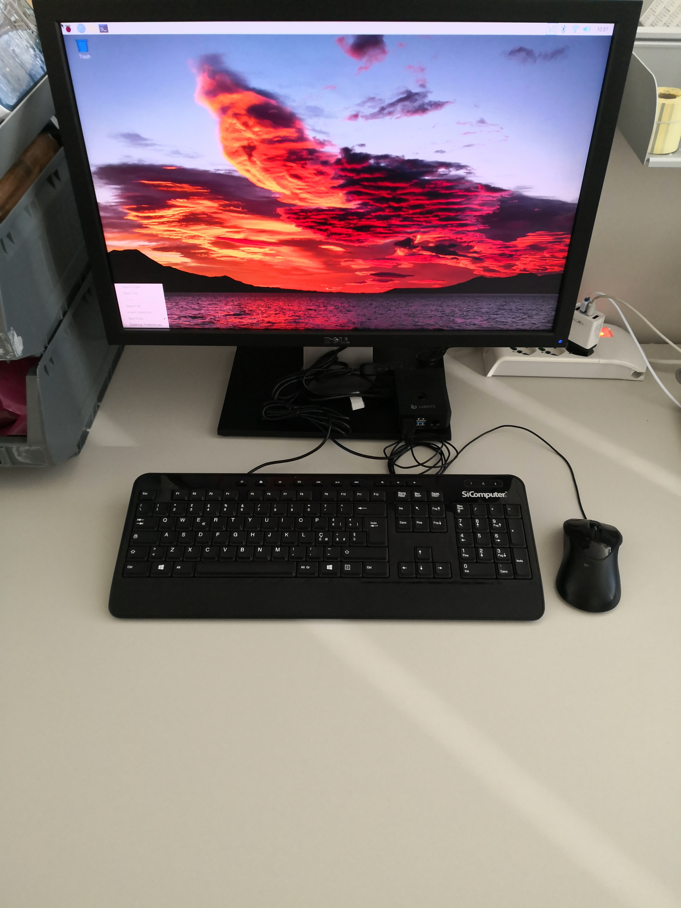
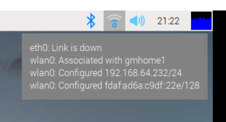
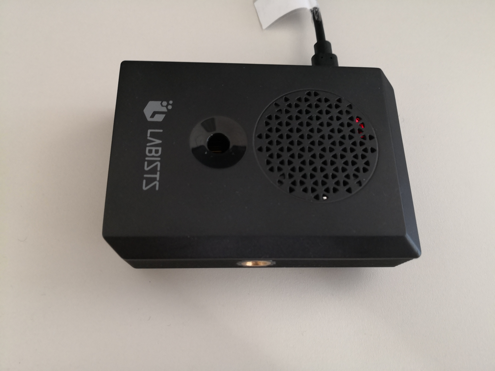
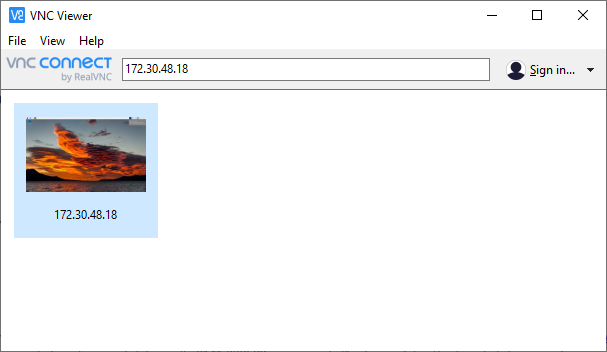
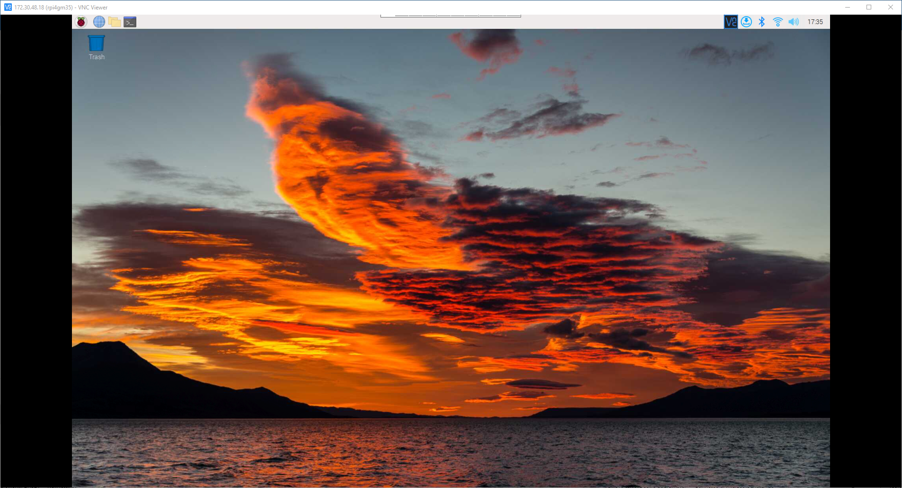
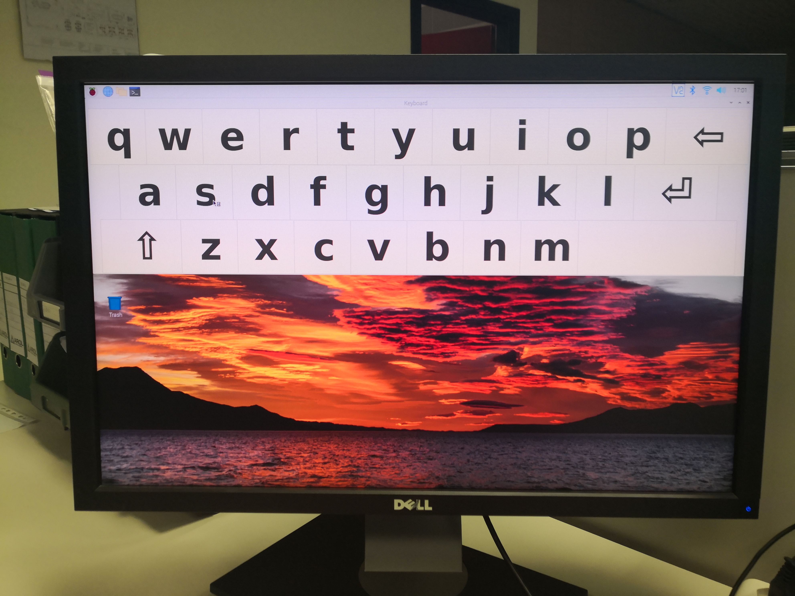

# HOWTO: Preparing a Raspberry Pi 4B for the ARNEIS project

<!-- (2022-01-12 07:44 CET) -->

## Introduction

The following document explains how to prepare and configure a Raspberry Pi for the [ARNEIS project](https://github.com/B-AROL-O/ARNEIS).

## Prerequisites

* One [Raspberry Pi](https://www.raspberrypi.org/).
  - Tested on rpi4gm35 ([Raspberry Pi 4B 4GB](https://www.amazon.com/Raspberry-Model-2019-Quad-Bluetooth/dp/B07TC2BK1X))
* One MicroSD card of at least 4GB.
  - **IMPORTANT**: The card should be blank, or at least should not contain any important data since it will be completely erased.
  - Tested with a [SanDisk Ultra 256 GB MicroSDXC](https://www.amazon.it/SanDisk-microSDXC-adattatore-prestazioni-Rosso-Grigio/dp/B08GY8NHF2)
* One desktop PC or laptop for formatting the SD card and controlling the RPi
  - OS: A recent version of Windows or Linux or macOS
  - The PC should have a MicroSDHC card reader.
    Alternatively, an additional USB MicroSD card reader is required
* Fast internet connection

## Step-by-step instructions

### Prepare the MicroSD card with Raspberry Pi OS

Launch a browser on your laptop and open <https://www.raspberrypi.com/software/>

Download [Raspberry Pi Imager](https://www.raspberrypi.com/software/) and install it on your laptop.

Insert a MicroSD card into one slot of your laptop.
Alternatively, insert the MicroSD into the USB card reader, then plug the USB card reader into one empty USB port of your laptop.

Launch the [Raspberry Pi Imager](TODO) and select the following options

* Sistema operativo: Raspberry Pi OS (32-bit)
* Scheda SD: MXT-USB Storage Device USB Device - 255.9 GB

then click "SCRIVI".

> **Attenzione**
>
> Tutti i dati esistenti in 'MXT-USB Storage Device USB Device' verranno eliminati.
> Sei sicuro di voler continuare?
>
> [NO](TODO) | [SI](TODO)

Click "SI".

...

> **Scrittura completata senza errori**
>
> Scrittura di **Raspberry Pi OS (32-bit)** in **MXT-USB Storage Device USB Device** completata.
>
> Ora puoi rimuovere la scheda SD dal lettore
>
> [CONTINUA](TODO)

Remove the MicroSD from your laptop

### First boot of the RPi with the new MicroSD card

(2022-01-12 08:35 CET)

* Insert the MicroSD card into your Raspberry Pi.
* Connect a display using a MicroHDMI-to-HDMI cable
* Connect a USB keyboard to the first USB 2.0 port of the RPi4
* Connect a USB mouse to the second USB 2.0 port of the RPi4
* Connect a 5Vdc, 3A power supply to the USB-C port of the RPi4

Turn on the power supply and wait for Raspberry Pi OS to boot.

> **Welcome to Raspberry Pi**
>
> Welcome to the Raspberry Pi Desktop!
>
> Before you start usin it, there are a few things to set up.
>
> Press 'Next' to get started.
>
> [Cancel](TODO) | [Next](TODO)

Click "Next".

> **Set Country**
>
> Enter the details of your location.
> This is used to set the language, time zone, keyboard and other international settings.
>
> * Country: Italy
> * Language: Italian
> * Timezone: Rome
>
> * [x] Use English language
> * [ ] Use US keyboard
>
> Press 'Next' when you have made your selection.
>
> [Back](TODO) | [Next](TODO)

Fill in the form as shown above, then click "Next"

...

> **Change Password**
>
> The default 'pi' user account currently has the password 'raspberry'.
> It is strongly recommended that you change this to a different
> password that only you know
>
> * Enter new password: xxxx
> * Confirm new password: xxx
>
> * [x] Hide characters
>
> Press 'Next' to activate your new passowrd.
>
> [Back](TODO) | [Next](TODO)

Fill in the form as instructed, then click "Next"

> **Set Up Screen**
>
> You should be able to set the taskbar along the top of the screen.
> Tick the box if some or all of it does not fit on the screen.
>
> [ ] The taskbar does not fit one the screen
>
> The change will take effect when the Pi is restarted.
>
> Press 'Next' to save your setting.
>
> [Back](TODO) | [Next](TODO)

Verify and update if needed, then click "Next".

> **Select WiFi Network**
>
> Select your WiFi network from the list.
>
> ...
>
> Press 'Next' to connect, or 'Skip' to continue without connecting.
>
> [Back](TODO) | [Skip](TODO) | [Next](TODO)

Select the desired WiFi network, then click "Next".
If the select network is protected you will be requested the password

> **Enter WiFi Network**
>
> Enter the password for the WiFi network 'xxxx'.
>
> * Password: yyyy
>
> [x] Hide characters
>
> Press 'Next' to connect, or 'Skip' to continue without connecting.
>
> [Back](TODO) | [Skip](TODO) | [Next](TODO)

Click "Next".

> **Update Software**
>
> The operating system and applications will now be checked and
> updated if necessary. This may involve a large download.
>
> Press 'Next' ...
>
> [Back](TODO) | [Skip](TODO) | [Next](TODO)

Click "Next".

> Download updates - please wait.

When the update is complete the following popup should be displayed

> System is up to date
>
> [OK](TODO)

Click "OK" to continue.

> **Setup Complete**
>
> Your Raspberry Pi is now set up and ready to go.
>
> To run applications, click the raspberry icon
> in the top left corner of the screen to open the menu.
>
> Press 'Restart' to restart your Pi so the new settings will take effect.
>
> [Back](TODO) | [Later](TODO) | [Restart](TODO)

Click "Restart".

Verify that the RPi reboots correctly.




### Display assigned IP addresses

To know the IP addresses assigned to the Raspberry Pi just move the mouse over the network icon at the top right of the desktop




### Configure hostname, SSH and VNC

<!-- (2022-01-12 10:10 CET) -->

Open a terminal and type the following command

```bash
sudo raspi-config
```

* Select "1" (System Options), then "S4" (Hostname)
* Enter hostname: `rpi4gm35` (will replace default hostname `raspberrypi`)
* Select "3" (Interface Options), then "I2" (SSH)
* Select "Yes" to enable SSH
* Select "3" (Interface Options), then "I3" (VNC)
* Select "Yes" to enable VNC
* Reboot if requested

Verify that the RPi is accessible from the laptop via SSH and VNC
(you may need to scan the local Wi-Fi network to get the IPv4 address assigned by the router)

HINT: To scan the network and identify the open services you can use one of those tools

- The [Fing app](https://www.fing.com/) on a mobile phone or on your laptop.
- [nmap](https://nmap.org/)

It this works disconnect the USB keyboard, mouse and display



Reboot your RPi4 and verify that the device is still accessible from SSH:

```text
gpmacario@HW2457 MINGW64 ~
$ ssh pi@172.30.48.18
pi@172.30.48.18's password:
Linux rpi4gm35 5.10.63-v7l+ #1488 SMP Thu Nov 18 16:15:28 GMT 2021 armv7l

The programs included with the Debian GNU/Linux system are free software;
the exact distribution terms for each program are described in the
individual files in /usr/share/doc/*/copyright.

Debian GNU/Linux comes with ABSOLUTELY NO WARRANTY, to the extent
permitted by applicable law.
Last login: Wed Jan 12 16:36:38 2022
pi@rpi4gm35:~ $
```

Do the same using a VNC client (in my case I used the free to use [VNC&reg; Viewer](https://www.realvnc.com/en/connect/download/viewer/))



Double click on the selected profile to connect to the remote desktop of the Raspberry Pi:



### (Recommended) Create a public DNS entry

If you have administrative rights to a DNS zone you may choose to access your Raspberry Pi using a symbolic name rather than an IP address.

If so, access your DNS administrative page (in my case, <https://register.it/>) and create an A record to map the name to the IP address assigned to your Raspberry Pi.

In my case

> `A rpi4gm35 172.30.48.18`

Wait until the DNS zone is propagated, then verify that the device can be accessed by another host (in our case, our laptop) using the assigned name rather than its IP address:

```bash
gpmacario@HW2457 MINGW64 ~
$ ping rpi4gm35.gmacario.it

Esecuzione di Ping rpi4gm35.gmacario.it [172.30.48.18] con 32 byte di dati:
Risposta da 172.30.48.18: byte=32 durata=8ms TTL=64
Risposta da 172.30.48.18: byte=32 durata=7ms TTL=64
Risposta da 172.30.48.18: byte=32 durata=6ms TTL=64
Risposta da 172.30.48.18: byte=32 durata=6ms TTL=64

Statistiche Ping per 172.30.48.18:
    Pacchetti: Trasmessi = 4, Ricevuti = 4,
    Persi = 0 (0% persi),
Tempo approssimativo percorsi andata/ritorno in millisecondi:
    Minimo = 6ms, Massimo =  8ms, Medio =  6ms

gpmacario@HW2457 MINGW64 ~
$
```

### Configure public SSH keypair

Logged in as pi@rpi4gm45, create a public/private SSH keypair:

```bash
ssh-keygen
```

Type the following commands to be able to login to your Raspberry Pi through your public SSH key - for instance:

```bash
cat <<END >>$HOME/.ssh/authorized_keys
ssh-rsa AAAAB3Nza....W1cG35r8= gpmacario@HW2457
END
```

Test


```bash
gpmacario@HW2457 MINGW64 ~
$ ssh pi@rpi4gm45.gmacario.it
Linux rpi4gm35 5.10.92-v7l+ #1514 SMP Mon Jan 17 17:38:03 GMT 2022 armv7l

The programs included with the Debian GNU/Linux system are free software;
the exact distribution terms for each program are described in the
individual files in /usr/share/doc/*/copyright.

Debian GNU/Linux comes with ABSOLUTELY NO WARRANTY, to the extent
permitted by applicable law.
Last login: Thu Jan 20 09:12:23 2022
pi@rpi4gm35:~ $
```


### Install Virtual Keyboard

Reference: <https://pimylifeup.com/raspberry-pi-on-screen-keyboard/>

Logged in as pi@rpi4gm45, type the following commands to setup the On-Screen Keyboard:

```bash
sudo apt update
sudo apt upgrade
sudo apt install -y matchbox-keyboard
```

Test: On the Raspberry Pi OS dashboard run

Accessories > Keyboard


Result:




<!--
### Install git-aware-prompt

TODO
>

<!--
### Configure remote access through Visual Studio Code

TODO
>


### Clone ARNEIS sources from GitHub

<!-- (2022-01-20 09:50 CET) -->

Logged in as pi@rpi4gm45

```bash
mkdir -p ~/github/B-AROL-O
cd ~/github/B-AROL-O
git clone https://github.com/B-AROL-O/ARNEIS.git
```


### Install DepthAI

<!-- (2022-01-20 09:51 CET) -->

Reference: <https://docs.luxonis.com/en/latest/pages/tutorials/first_steps>

Logged in as pi@rpi4gm35, type the following command to install DepthAI

```bash
sudo apt update
sudo apt install -y python3-pip python3-venv

mkdir -p ~/github/luxonis
cd ~/github/luxonis
git clone https://github.com/luxonis/depthai.git
```

Now create a Python virtualenv

```bash
cd ~/github/luxonis/depthai
python3 -m venv .venv
source .venv/bin/activate
pip install -U pip
```

Install requirements

```bash
python3 install_requirements.py
```

Install some missing binary packages (for some unknown reasons neither pip nor virtualenv automatically install them)

```bash
sudo apt-get install libcblas-dev
sudo apt-get install python3-h5py
```

Add a new udev rule for the script to be able to access the OAK-D-Lite device correctly.

```bash
echo 'SUBSYSTEM=="usb", ATTRS{idVendor}=="03e7", MODE="0666"' \
    | sudo tee /etc/udev/rules.d/80-movidius.rules
sudo udevadm control --reload-rules \
    && sudo udevadm trigger
```

Check Linux kernel messages

```bash
sudo dmesg -w
```

Connect the OAK-D-Lite to one USB 3.0 port of the Raspberry Pi using a USB 3.0 cable (USB-A to USB-C).

As soon as the OAK-D-Lite gets recognize the following messages should be displyed on the kernel log:

```text
[ 5253.298901] usb 1-1.2: new high-speed USB device number 4 using xhci_hcd
[ 5253.429951] usb 1-1.2: New USB device found, idVendor=03e7, idProduct=2485, bcdDevice= 0.01
[ 5253.429971] usb 1-1.2: New USB device strings: Mfr=1, Product=2, SerialNumber=3
[ 5253.429987] usb 1-1.2: Product: Movidius MyriadX
[ 5253.430002] usb 1-1.2: Manufacturer: Movidius Ltd.
[ 5253.430017] usb 1-1.2: SerialNumber: 03e72485
```

Run the demo script

```bash
python3 depthai_demo.py
```

Result: The `depthai_demo.py` program is executed correctly on the Raspberry Pi.


**NOTE**: If `depthai_demo.py` is started from a remote SSH shell, the following error is displayed:

```text
(.venv) pi@rpi4gm35:~/github/luxonis/depthai $ export DISPLAY=0.0
(.venv) pi@rpi4gm35:~/github/luxonis/depthai $ python3 depthai_demo.py
Using depthai module from:  /home/pi/github/luxonis/depthai/.venv/lib/python3.9/site-packages/depthai.cpython-39-arm-linux-gnueabihf.so
Depthai version installed:  2.14.1.0.dev+27fa4519f289498e84768ab5229a1a45efb7e4df
Setting up demo...
Available devices:
[0] 19443010E106F01200 [X_LINK_UNBOOTED]
USB Connection speed: UsbSpeed.SUPER
Unable to init server: Could not connect: Connection refused

(color:2626): Gtk-WARNING **: 21:11:11.516: cannot open display: 0.0
python3: ../../libusb/os/threads_posix.h:58: usbi_mutex_destroy: Assertion `pthread_mutex_destroy(mutex) == 0' failed.
python3: ../../libusb/os/threads_posix.h:46: usbi_mutex_lock: Assertion `pthread_mutex_lock(mutex) == 0' failed.
Aborted
Traceback (most recent call last):
  File "/home/pi/github/luxonis/depthai/depthai_demo.py", line 998, in <module>
    s.runDemo(args)
  File "/home/pi/github/luxonis/depthai/depthai_helpers/supervisor.py", line 46, in runDemo
    subprocess.check_call(' '.join([f'"{sys.executable}"', "depthai_demo.py"] + new_args), env=new_env, shell=True, cwd=repo_root)
  File "/usr/lib/python3.9/subprocess.py", line 373, in check_call
    raise CalledProcessError(retcode, cmd)
subprocess.CalledProcessError: Command '"/home/pi/github/luxonis/depthai/.venv/bin/python3" depthai_demo.py --noSupervisor --guiType cv' returned non-zero exit status 134.
(.venv) pi@rpi4gm35:~/github/luxonis/depthai $
```

<!-- EOF -->
