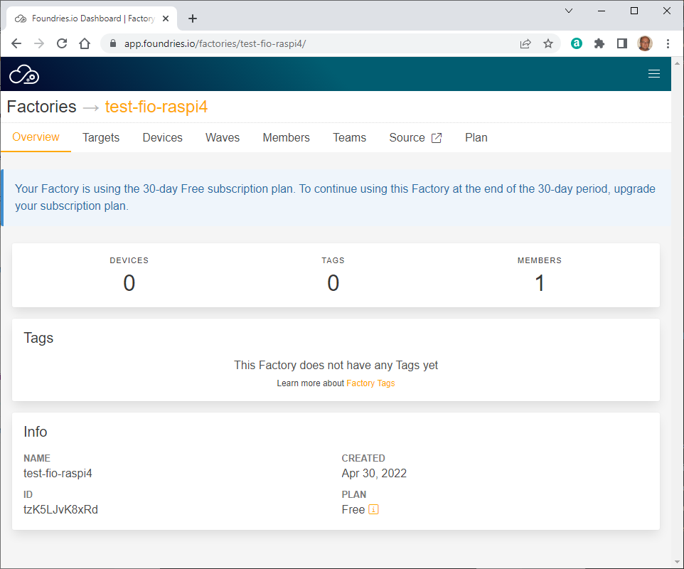

# HOWTO Use Foundries.io

## Introduction

TODO

## Step-by-step instructions

Browse <https://app.foundries.io/factories>

> **No Factories**
>
> Create your first Factory, and start your next product.
>
> [New Factory...](https://app.foundries.io/factories) | [Learn more](https://docs.foundries.io/latest/getting-started/signup/index.html#create-a-factory)

Click on "New Factory..."

> **Create Factory**
>
> **Choose a name for your factory**
>
> Fields marked with \* are required
>
> * **Platform** \*: Default (RaspberryPi 64-bit)
>
> * **Factory name** \*: (empty)
>   - 2 to 26 lowercase alphanumeric characters, must start with an alphanumeric character, can contain also - and _
>
> Cancel | Prev | Next

Fill in the required information

* Platform: `Default (RaspberryPi 4 64-bit)`
* Factory name: `test-fio-raspi4`

then click "Next".

> **Select a subscription plan for your factory**
>
> Pay Monthly | Pay Yearly
>
> **Free / $0 / 30-day trial**
> - No credit card required
> - For personal use
> - 3 builds a day
> - 10 managed devices
> - community support
>
> **Commercial / $5,000 / product / month**
> - For commercial use
> - Unlimited builds
> - Unlimited managed devices
> - Priority support
>
> Prices do not include taxes: we might have to collect taxes based on your billing country.
>
> Cancel | Prev | Next

Select "Free", then click "Next"

<!-- (2022-04-30 09:04 CEST) -->

> **Almost there, review & create your factory**
>
> Fields marked with \* are required
>
> * Factory name: test-fio-raspi4
> * Factory platform: Default (RaspberryPi 4 64-bit)
> * Selected plan: Free Factory
> * Plan fee: $ 0
> * Taxes: $ 0
> * Total before taxes: $ 0
> * Total due on **Apr 30, 2022**: $ 0
>
> * [ ] I agree to the [FoundriesFactory Subscription](https://foundries.io/terms/) terms \*
>
> Cancel | Prev | Create Factory

Review the displayed information, check "I agree", then click "Create Factory".

<!-- EOF -->
