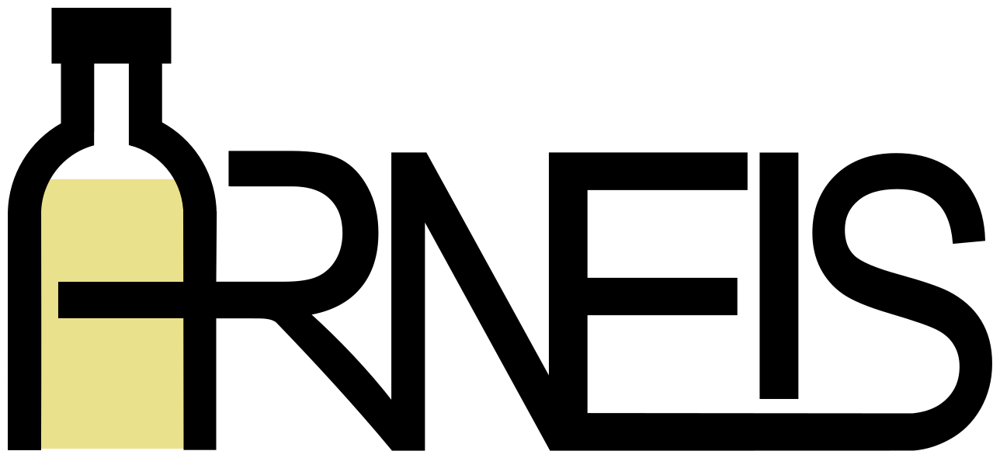

.. ARNEIS documentation master file, created by
   sphinx-quickstart on Wed Jan 19 05:33:23 2022.
   You can adapt this file completely to your liking, but it should at least
   contain the root `toctree` directive.

==============================
Welcome to the ARNEIS Project!
==============================

The **ARNEIS** (short for ``A`` utomated ``R`` ecognizer,  ``N`` etwork - ``E`` nabled, ``I`` tem ``S`` orter)
is a Top 10 Finalist to the `OpenCV Spatial AI Contest <https://opencv.org/opencv-spatial-ai-contest/>`_
sponsored by `Intel® <https://www.intel.com/>`_ and `Microsoft Azure <https://azure.microsoft.com/>`_.

**************
This is ARNEIS
**************

ARNEIS in a nutshell
--------------------

ARNEIS aims at reproducing in scale a packaging machine for the `Industry-4.0 <https://en.wikipedia.org/wiki/Fourth_Industrial_Revolution>`_.

.. raw:: html

    

        <iframe src="https://www.youtube.com/embed/7qxbT31U5dE" frameborder="0" allowfullscreen style="position: absolute; top: 0; left: 0; width: 100%; height: 100%;"></iframe>
    

This goal is achieved by means of a combination of:

* An `OAK-D-Lite <https://docs.luxonis.com/projects/hardware/en/latest/pages/DM9095.html>`_ Spatial AI camera
* A lot of `LEGO® Technic <https://www.lego.com/>`_ parts
* ... and plenty of Open Source software

If you want to know some history about this project please watch the webinar we gave on 2022-03-17:

.. raw:: html

    

        <iframe src="https://www.youtube.com/embed/nwAOgkqVJMo" frameborder="0" allowfullscreen style="position: absolute; top: 0; left: 0; width: 100%; height: 100%;"></iframe>
    

ARNEIS Project sources
----------------------

The source files for the software programs, the LEGO® MOC as well as the documentation site are maintained in the GitHub repository at `github.com/B-AROL-O/ARNEIS <https://github.com/B-AROL-O/ARNEIS>`_.

Whenever the ``main`` branch of the git repository is updated, `this site <https://arneis.readthedocs.io/>`_ will be updated accordingly.

How to stay in touch
-------------------

The ARNEIS project roadmap is `maintained on GitHub <https://github.com/B-AROL-O/ARNEIS/milestones?direction=asc&sort=due_date&state=open>`_.

`Gianpaolo Macario <https://github.com/gmacario/>`_ publishes regular updates of the ARNEIS project on `his personal blog <https://gmacario.github.io/posts>`_.

You may also follow `twitter.com/baroloteam <https://twitter.com/baroloteam>`_ to get notified about the progress of the project.

Please report bugs and feature requests on https://github.com/B-AROL-O/ARNEIS/issues,
or DM the `B-AROL-O Team on Twitter <https://twitter.com/baroloteam>`_ about security issues or other non-public topics.

.. toctree::
   :caption: Home
   :maxdepth: 2
   :hidden:

   self

*************
Documentation
*************

Here you find reference information used in redaction of the this document,
and, if you want, some useful links following the story of the
project by social-media publication.

* :doc:`acronyms`
* :doc:`bibliography`
* :doc:`arneis-social-media`
* :doc:`sysint/arneis-sysint-1.0`

.. toctree::
   :caption: Documentation
   :maxdepth: 1
   :hidden:

   acronyms
   bibliography
   arneis-social-media
   sysint/arneis-sysint-1.0

************
Architecture
************

Learn more about the ARNEIS project architecture.

* :doc:`architecture/arneis-spec`
* :doc:`architecture/arneis-sysarch`
* :doc:`architecture/arneis-swarch`

.. toctree::
   :caption: Architecture
   :maxdepth: 1
   :hidden:

   architecture/arneis-spec
   architecture/arneis-sysarch
   architecture/arneis-swarch

*************
How-to Guides
*************

These guides will help walk you through specific use cases the team has
gone through during the project realization.

* **For documentation authors**:
   * :doc:`howto/howto-configure-arneis-readthedocs-io`
   * :doc:`howto/howto-create-landing-page-netlify`
   * :doc:`howto/howto-configure-google-analyics`
   * :doc:`howto/howto-use-mermaid-graphic-tool`

* **Learning AI and related tools**:
   * :doc:`howto/howto-install-depthai-on-rpi`
   * :doc:`howto/howto-install-depthai-on-windows10`
   * :doc:`howto/howto-train-deploy-NN`

* **For Embedded electronics enthusiast**:
   * :doc:`howto/howto-control-rpi-poweredup`
   * :doc:`howto/howto-install-raspios64`
   * :doc:`howto/howto-prepare-rpi4b-for-arneis`
   * :doc:`howto/howto-getting-started-foundriesio`
   * :doc:`howto/howto-testing-portenta-x8`

* **For system integrators**:
   * :doc:`howto/howto-create-vm-on-azure`
   * :doc:`howto/howto-install-k3s-for-arneis`

.. toctree::
   :caption: HOWTOs
   :maxdepth: 1
   :hidden:
   :glob:

   howto/howto-configure-arneis-readthedocs-io
   howto/howto-create-landing-page-netlify
   howto/howto-configure-google-analytics
   howto/howto-use-mermaid-graphic-tool

   howto/howto-install-depthai-on-rpi
   howto/howto-install-depthai-on-windows10
   howto/howto-train-deploy-NN
   
   howto/howto-control-rpi-poweredup
   howto/howto-install-raspios64
   howto/howto-prepare-rpi4b-for-arneis
   howto/howto-getting-started-foundriesio
   howto/howto-testing-portenta-x8
   
   howto/howto-create-vm-on-azure
   howto/howto-install-k3s-for-arneis

*****
LEGO®
*****

Here you find our collection of activities related to the development and construction
of the ARNEIS LEGO MOC.

* **The original set we use**:
   * :doc:`lego-set-42100/README`
   * :doc:`lego-set-42100/unboxing-lego-set-42100`

* **The ARNEIS MOC**:
   * :doc:`lego/studies`
   * :doc:`lego/camera-support`
   * :doc:`lego/conveyor-wip`
   * :doc:`lego/arneis-moc`

.. toctree::
   :caption: LEGO®
   :maxdepth: 1
   :hidden:
   
   lego-set-42100/README
   lego-set-42100/unboxing-lego-set-42100
   lego/studies
   lego/camera-support
   lego/conveyor-wip
   lego/arneis-moc

******************
Indices and tables
******************

* :ref:`genindex`
* :ref:`search`
