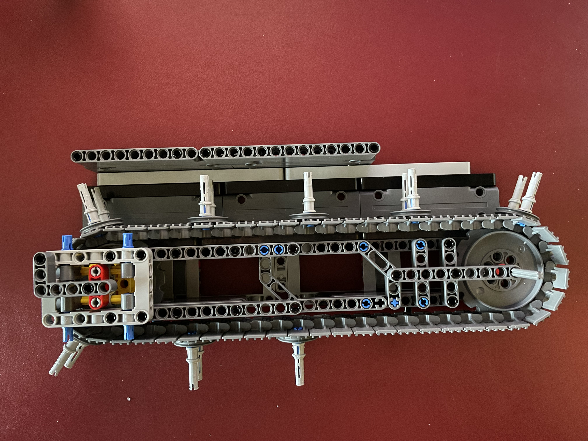
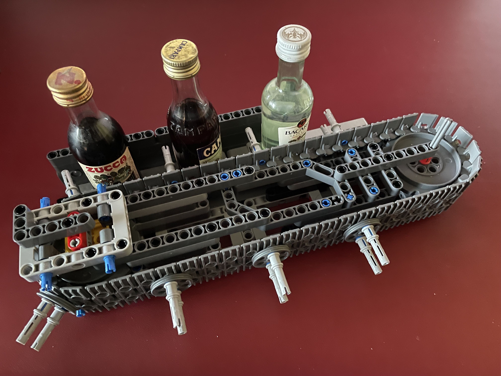
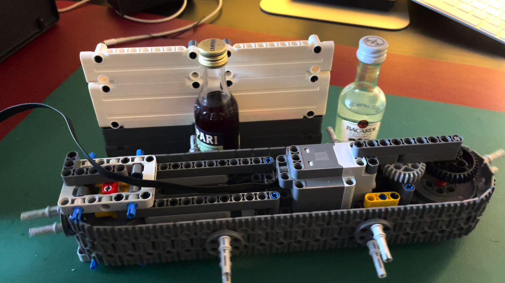
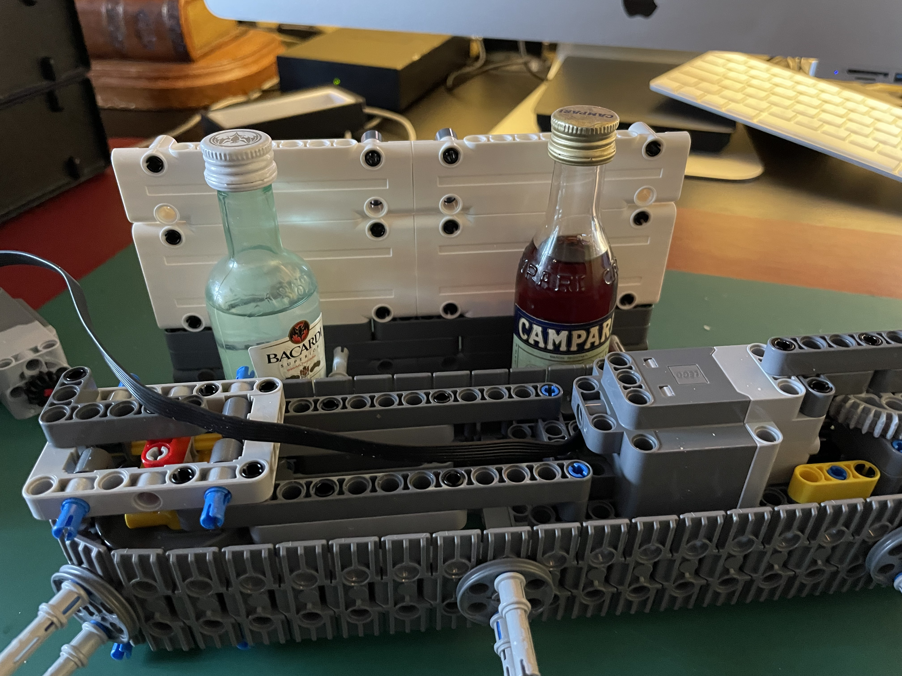
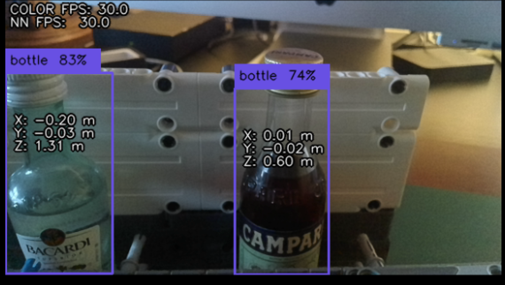

# LEGO&reg; MOCs Work in Progress

Here are some physical assembly based on the [MOC studies](studies.md).

---

## First conveyor idea

This shows the basic idea used for the movement of miniature bottles.

The bottles slide on a smooth surface and are pushed by small pushers mounted on a track chain mounted transversely.

To adjust the correct chain tension, one of the two sprockets is mounted on a support slide that can be suitably adjusted before being fixed in the best position suitable for correct tensioning.

### Here is the conveyor still with no motor
On left side of the image is visible the support slide of the sprocket (yellow and red parts).
The right sprocket will be used to pull the chain by a gear train driven by a motor.

### And with some mignon bottles

A small part of the route has been prepared for the passage of the bottles.

The bottles lean against a small contrasting wall which creates a path for their guided movement.

### And some manual movement

Here are some manual operations to verify the overall idea of the movement of the bottles in the layout.

---

## Motorizing the conveyor and taking some bottles snapshots

Next step in conveyor development is the motorisation of the movement.

The main improvements of the previous project are:
- addition of a gear train and a motor to drive the conveyor
- introduction of a white background in the area used to take bottles snapshots
- added more space between the bottles

### The motor and the white backplane

Motor is integrated inside the main structure of the conveyor for a reduced space impact on the project.

The white background may facilitate the contrast in the picture of the bottle's nec.

### Conveyor movement in all its glory

The motor used is a [Electric, Motor Powered Up, XL](https://www.bricklink.com/v2/catalog/catalogitem.page?P=bb0960c01&idColor=85) driven by a [Electric Battery Box Powered Up Bluetooth Hub](https://www.bricklink.com/v2/catalog/catalogitem.page?P=bb0961c01&idColor=86) (out of the image)

### Bottles in pose and the resulting image

Two mignon bottles in pose for a good snapshot...

... and the resulting picture from a [OAK-D-Lite camera](https://docs.luxonis.com/projects/hardware/en/latest/pages/DM9095.html)

