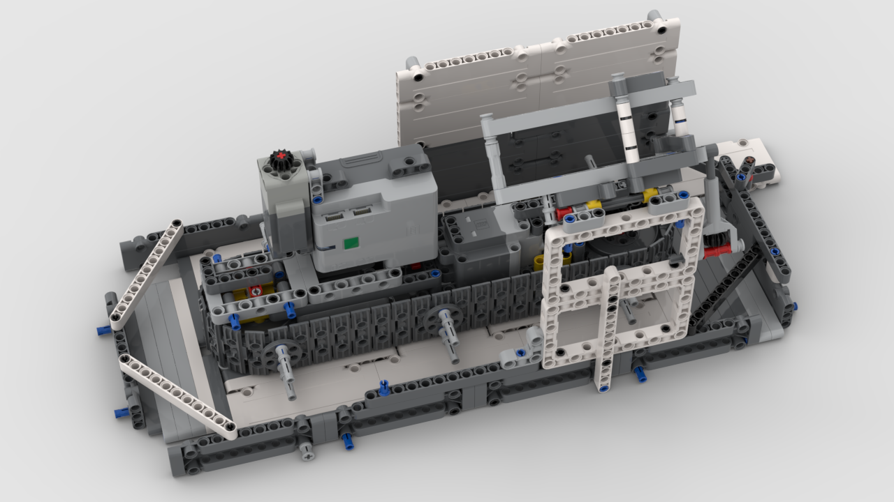

# LEGO&reg; ARNEIS Project

Here is the LEGO&reg; MOC (alias for _My Own Creation_) used for the ARNEIS project.

> **Resources**
>
> For the realization of the LEGO&reg; project, various software applications and public resources are used :
>
> Resource | Description | Used For
> ----|----|-----
> [Bricklink Studio](https://www.bricklink.com/v3/studio/download.page) | Full featured CAD application| Project design, BOM creation, rendering, instruction manual editing, export to `ldr`
> [Bricklink PartDesigner](https://www.bricklink.com/v3/studio/partdesigner.page) | Single LEGO&reg; Part Editor | Creation of parts still not avalaible in _Bricklink Studio_. Correction of parts not working whern exported to `ldr`
> [LeoCAD](https://www.leocad.org) | Open Source CAD application | Check correctness of `ldr` files
> [LDraw](https://www.ldraw.org) | Centralized resources for LEGO&reg; CADs | Reference for getting last _parts_ used in _Bricklink PartDesigner_

## ARNEIS Conveyor (v.2022.03.12)

This conveyor is used to move mignon bottles. The main idea is to use a chain where some kind of _pushers_ are used to move bottles over a flat surface.

The chain is not used as a base surface for the bottles for the difficulty of maintaining the chain as an flat orizontal base during the movement.

A special support is designed to support the OAK-D-Lite AI Camera used in this project. It possible to change camera inclination by using the dedicated linear extender arm.

A white wall is designed as a background for the bottles snapshotting.



### Driving the conveyor

To test the functionement of the conveyor, a `microPython` special code can be used.

All you need browsing [Pybricks](https://pybricks.com) home page and follow the instruction to activate the IDE for your browser and your operating system.

In the project two motors are used:
- 1 Technic Motor Power Up XL: used to drive the conveyor
- 1 Technic Motor Power UP L: used as a _Speed Dial_

With the **XL** motor connected to the **Port B** of the Technic HUB and the **L** motor connected to the **Port A**, use the following code to program the HUB


```python
from pybricks.pupdevices import Motor
from pybricks.parameters import Port, Stop
from pybricks.tools import wait

# We'll use two motors. One is a dial
# to set the speed of the other motor.
motor = Motor(Port.B)
dial = Motor(Port.A)

# Say hello :)
print("Hello, Pybricks!")

# First, we'll move the dial to zero.
dial.run_target(500, 0, Stop.COAST)

while True:
    # Set the speed based on dial angle
    speed = dial.angle()*3
    if abs(speed) < 50:
        speed = 0

    # Run motor at desired speed
    motor.run(speed)

    angle = dial.angle()
    print("angle=" + str(angle) + "    ", end='\r')

    # Wait briefly, then repeat
    wait(10)
```

Rotate the dial clockwise or couterclockwise to regulate the speed and direction of the conveyor.

### Project resources

> **Files**
>
> [`arneis-conveyor-20220312.io`](arneis-conveyor-20220312.io) : the LEGO project in _Bricklink Studio_ CAD.<br/>
> [`arneis-conveyor-20220312.ldr`](arneis-conveyor-20220312.ldr) : the LEGO project exported in [LDraw file format](https://www.ldraw.org/article/218.html).<br/>
> [`arneis-conveyor-20220312.png`](arneis-conveyor-20220312.png) : a rendered version image<br/>
> [`arneis-conveyor-20220312.pdf`](arneis-conveyor-20220312.pdf) : building instruction manual
