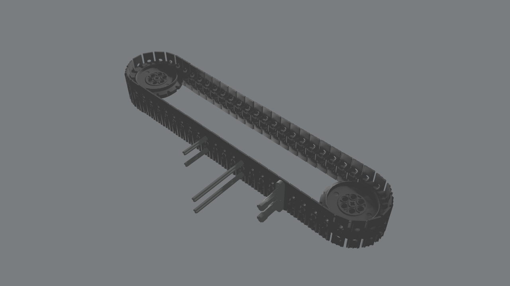
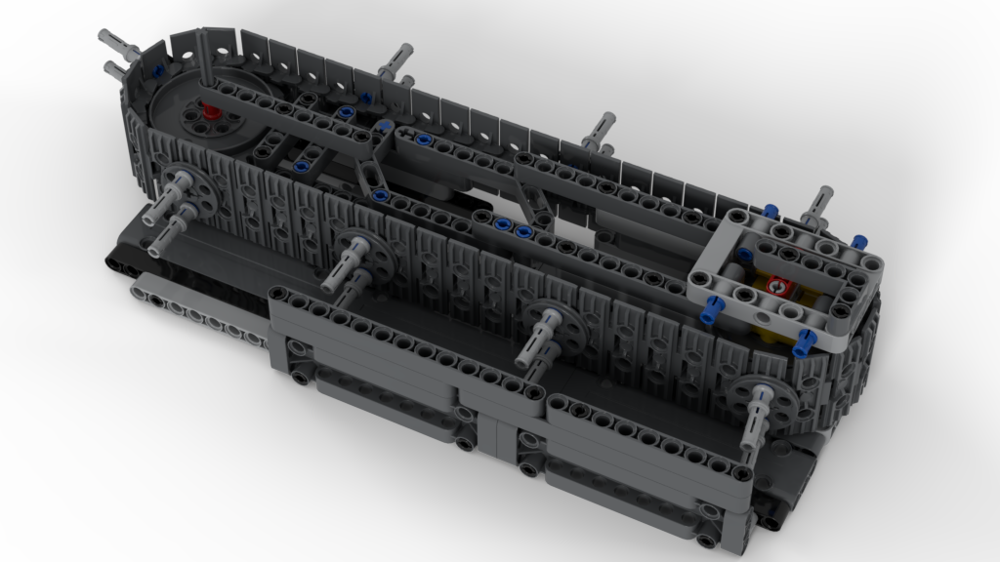

# LEGO&reg; MOC studies

In this folder are stored various studies as LEGO&reg; MOC (alias for _My Own Creation_).

> **Resources**
>
> For the realization of the LEGO&reg; project, various software applications and public resources are used :
>
> Resource | Description | Used For
> ----|----|-----
> [Bricklink Studio](https://www.bricklink.com/v3/studio/download.page) | Full featured CAD application| Project design, BOM creation, rendering, instruction manual editing, export to `ldr`
> [Bricklink PartDesigner](https://www.bricklink.com/v3/studio/partdesigner.page) | Single LEGO&reg; Part Editor | Creation of parts still not avalaible in _Bricklink Studio_. Correction of parts not working whern exported to `ldr`
> [LeoCAD](https://www.leocad.org) | Open Source CAD application | Check correctness of `ldr` files
> [LDraw](https://www.ldraw.org) | Centralized resources for LEGO&reg; CADs | Reference for getting last _parts_ used in _Bricklink PartDesigner_

## First Conveyor (v.001)

This is the first idea of a conveyor used to move bottles. The main idea is to use a chain where some kind of _pushers_ are used to move bottles over a flat surface.

The chain is not used as a base surface for the bottles for the difficulty of maintaining the chain as an flat orizontal base during the movement.

> **Files**
>
> [`Conveyor_001.ldr`](Conveyor_001.ldr) :  the lego project exported in [LDraw file format](https://www.ldraw.org/article/218.html). 
> [`Conveyor_001.png`](Conveyor_001.png) : a rendered version image

## Bottle Conveyor (2022-01-22)

This is the evolution of the **First Conveyor (v.001)** idea.

This project represent the complete structure needed to sustain the chain.

The parts used in this design are all from the LEGO&reg; [42100 Liebherr R9800](https://www.bricklink.com/v2/catalog/catalogitem.page?S=42100-1) set.

Main features of this design are:
- smooth bottle sliding surface
- adjustable chain tensioner
- easily reconfigurable bottle pushers

<iframe width="560" height="315" src="https://www.youtube.com/embed/BFKyx1COfqk" title="YouTube video player" frameborder="0" allow="accelerometer; autoplay; clipboard-write; encrypted-media; gyroscope; picture-in-picture" allowfullscreen></iframe>

> **Files**
>
> [`bottle-conveyor-20220122.io`](bottle-conveyor-20220122.io) : the lego project in _Bricklink Studio_ CAD.  
> [`bottle-conveyor-20220122.ldr`](bottle-conveyor-20220122.ldr) :  the lego project exported in [LDraw file format](https://www.ldraw.org/article/218.html).
> [`bottle-conveyor-20220122.png`](bottle-conveyor-20220122.png) : a rendered version image
